# 🏗️ Tokyo-IA Architecture Documentation

> Comprehensive visual documentation of the Tokyo-IA project structure, workflows, and architecture using Mermaid diagrams.

## 📊 Project Composition

Tokyo-IA is a multi-language project that combines the strengths of different ecosystems:

### Language Breakdown
- **Go (44.8%)**: Core backend services, CLI tools, and APIs
- **Python (37.5%)**: AI agents, orchestration, ML components, and automation scripts
- **TypeScript (4.2%)**: Web dashboard and admin interface
- **Kotlin (4.1%)**: Android application
- **HTML (4.1%)**: Web interface templates
- **PLpgSQL (2.6%)**: Database functions and stored procedures
- **Others (2.7%)**: Ruby, configuration files, and templates

## 🗂️ Repository Structure

```mermaid
graph TB
    subgraph Repository["🏛️ Tokyo-IA Repository Structure"]
        cmd["cmd/<br/>🚀 Ejecutables principales<br/>main.go, elite, registry-api"]
        internal["internal/<br/>🔗 Servicios internos<br/>AI, Registry, Config"]
        lib["lib/<br/>⚙️ Lógica de negocio<br/>Agents, Generator, Orchestrator"]
        admin["admin/<br/>🛠️ Interfaz Admin<br/>React/TypeScript Dashboard"]
        proto["proto/<br/>📡 Protocol Buffers<br/>API definitions"]
        ruby["ruby/<br/>💎 Componentes Ruby<br/>Version management"]
        config["config/<br/>⚙️ Configuración<br/>AI models, settings"]
        docs["docs/<br/>📚 Documentación<br/>Architecture, guides, API"]
        testing["testing/<br/>🧪 Tests & Fixtures<br/>Test data"]
        db["db/<br/>🗄️ Database<br/>PostgreSQL schema"]
        app["app/<br/>📱 Android App<br/>Kotlin mobile app"]
        templates["templates/<br/>📋 Project Templates<br/>PWA, Bot, API, E-commerce"]
    end
    
    cmd --> lib
    cmd --> internal
    internal --> lib
    admin --> lib
    app --> internal
    proto -.->|make proto| lib
    ruby -.->|version.rb| lib
    templates -.->|scaffolding| cmd
    db -.->|schema| internal
    
    style cmd fill:#00ADD8,stroke:#333,color:#fff
    style lib fill:#00ADD8,stroke:#333,color:#fff
    style internal fill:#00ADD8,stroke:#333,color:#fff
    style ruby fill:#CC342D,stroke:#333,color:#fff
    style proto fill:#FFD700,stroke:#333
    style admin fill:#61DAFB,stroke:#333
    style app fill:#A97BFF,stroke:#333,color:#fff
    style db fill:#336791,stroke:#333,color:#fff
```

### Directory Details

| Directory | Purpose | Key Files |
|-----------|---------|-----------|
| `cmd/` | Application entry points | `main.go`, `elite/main.go`, `registry-api/main.go` |
| `internal/` | Internal packages | `ai/`, `registry/`, `config/` |
| `lib/` | Shared library code | `agents/`, `generator/`, `orchestrator/` |
| `admin/` | Admin web interface | `src/components/` (React/TypeScript) |
| `app/` | Android application | `src/main/java/` (Kotlin) |
| `config/` | Configuration files | `ai_models.yaml`, settings |
| `proto/` | Protocol Buffers | API definitions |
| `testing/` | Test files and fixtures | Test data and utilities |
| `docs/` | Documentation | Architecture, guides, API reference |
| `db/` | Database files | `schema.sql`, migrations |
| `ruby/` | Ruby components | Version management |
| `templates/` | Project templates | PWA, Bot, API, E-commerce |

## 🔄 Development Workflow

### Development Steps

1. **Write Code** (`📝 Código`): Make your changes to source files
2. **Format** (`make fmt`): Automatically format Go code with `gofmt`
3. **Build** (`make build`): Compile the application to `bin/tokyo-ia`
4. **Test** (`make test`): Run all unit tests
5. **Lint** (`make lint`): Run static analysis with `golangci-lint`
6. **CI Check** (`make ci`): Run complete CI suite locally
7. **Commit** (`git commit`): Commit changes to version control
8. **Push** (`git push`): Push to remote repository

## 🚀 CI/CD Pipeline

```mermaid
flowchart TD
    Start([🚀 Push código]) --> Fmt[make fmt<br/>Formatear Go]
    Fmt --> Build[make build<br/>Compilar servicios]
    Build --> Test[make test<br/>Tests unitarios]
    Test --> Lint[make lint<br/>Análisis estático]
    Lint --> Proto{¿Cambios<br/>en proto/?}
    Proto -->|Sí| ProtoGen[make proto<br/>Generar código]
    Proto -->|No| Ruby{¿Cambios<br/>en ruby/?}
    ProtoGen --> Ruby
    Ruby -->|Sí| Version[Actualizar<br/>version.rb<br/>semver]
    Ruby -->|No| CI[make ci<br/>Verificación completa]
    Version --> CI
    CI --> Success{✓ CI Pass?}
    Success -->|Sí| Deploy[✅ Listo para Deploy]
    Success -->|No| Fix[❌ Corregir errores]
    Fix --> Start
    
    style Start fill:#4CAF50,color:#fff
    style Deploy fill:#2196F3,color:#fff
    style Fmt fill:#FFC107
    style Build fill:#FF9800,color:#fff
    style Test fill:#FF9800,color:#fff
    style Lint fill:#FF9800,color:#fff
    style Fix fill:#f44336,color:#fff
    style ProtoGen fill:#9C27B0,color:#fff
    style Version fill:#9C27B0,color:#fff
```

### Pipeline Stages

1. **Format Check**: Ensure code follows Go formatting standards
2. **Build**: Compile all Go applications
3. **Test**: Run unit and integration tests
4. **Lint**: Static analysis with golangci-lint
5. **Proto Generation** (conditional): Generate code from Protocol Buffers
6. **Version Update** (conditional): Update Ruby version management
7. **CI Verification**: Complete validation suite
8. **Deploy**: Ready for production deployment

## 🌿 Branch Strategy

### Branch Workflow

- **main**: Production-ready code, tagged releases
- **develop**: Integration branch for features
- **feature/***: Individual feature development branches
- **hotfix/***: Emergency fixes for production issues
- **release/***: Release preparation branches

### Merge Strategy

1. Create feature branch from `develop`
2. Develop and test feature
3. Merge feature to `develop`
4. When ready for release, merge `develop` to `main`
5. Tag release with semantic versioning

## 🔄 Component Interaction

```mermaid
sequenceDiagram
    participant Dev as 👨‍💻 Desarrollador
    participant Git as 📦 Git
    participant Make as 🔧 Makefile
    participant CI as 🤖 CI/CD
    participant Proto as 📡 Proto Gen
    participant Ruby as 💎 Ruby Version
    
    Dev->>Make: make fmt
    Make-->>Dev: ✓ Código formateado
    Dev->>Make: make build
    Make-->>Dev: ✓ Build exitoso
    Dev->>Make: make test
    Make-->>Dev: ✓ Tests pasados
    
    alt Cambios en proto/
        Dev->>Proto: make proto
        Proto-->>Dev: ✓ Código generado
    end
    
    alt Cambios en ruby/
        Dev->>Ruby: Actualizar version.rb
        Ruby-->>Dev: ✓ Versión actualizada
    end
    
    Dev->>Git: git commit
    Git->>CI: trigger pipeline
    CI->>Make: make ci
    Make-->>CI: ✓ Todas las verificaciones
    CI-->>Dev: ✓ Listo para merge
```

### Interaction Flow

1. Developer runs local commands through Makefile
2. Makefile orchestrates build, test, and formatting operations
3. Conditional operations based on file changes (proto, ruby)
4. Git commit triggers CI/CD pipeline
5. CI/CD runs complete verification suite
6. Feedback provided to developer

## 🏗️ System Architecture

```mermaid
graph TB
    subgraph Clients["👥 Client Layer"]
        CLI[🖥️ CLI Tools]
        Web[🌐 Web Dashboard]
        Mobile[📱 Android App]
        API_Client[🔌 API Clients]
    end
    
    subgraph Services["⚙️ Service Layer"]
        MainApp[Tokyo-IA Main<br/>Go Application]
        RegistryAPI[Registry API<br/>Port 8080]
        EliteFramework[Elite Framework<br/>Project Generator]
    end
    
    subgraph Core["🧠 Core Logic"]
        AgentOrch[Agent Orchestrator<br/>Python]
        Generator[Code Generator<br/>Go]
        AIRouter[AI Model Router<br/>Go]
    end
    
    subgraph Agents["🤖 AI Agents"]
        Akira[侍 Akira<br/>Code Review]
        Yuki[❄️ Yuki<br/>Test Engineer]
        Hiro[🛡️ Hiro<br/>SRE/DevOps]
        Sakura[🌸 Sakura<br/>Documentation]
        Kenji[🏗️ Kenji<br/>Architecture]
    end
    
    subgraph Data["💾 Data Layer"]
        PostgreSQL[(PostgreSQL<br/>Database)]
        ConfigFiles[Configuration<br/>YAML Files]
    end
    
    CLI --> MainApp
    Web --> RegistryAPI
    Mobile --> RegistryAPI
    API_Client --> RegistryAPI
    
    MainApp --> Generator
    MainApp --> AIRouter
    EliteFramework --> Generator
    RegistryAPI --> AgentOrch
    
    Generator --> ConfigFiles
    AIRouter --> ConfigFiles
    AgentOrch --> Akira
    AgentOrch --> Yuki
    AgentOrch --> Hiro
    AgentOrch --> Sakura
    AgentOrch --> Kenji
    
    RegistryAPI --> PostgreSQL
    AgentOrch --> PostgreSQL
    
    style CLI fill:#00ADD8,stroke:#333,color:#fff
    style Web fill:#61DAFB,stroke:#333
    style Mobile fill:#A97BFF,stroke:#333,color:#fff
    style MainApp fill:#00ADD8,stroke:#333,color:#fff
    style RegistryAPI fill:#00ADD8,stroke:#333,color:#fff
    style AgentOrch fill:#3776AB,stroke:#333,color:#fff
    style PostgreSQL fill:#336791,stroke:#333,color:#fff
```

## 🔐 Security Architecture

### Security Measures

1. **API Token Encryption**: All API keys stored encrypted
2. **Input Validation**: Comprehensive validation at all entry points
3. **Rate Limiting**: Protection against abuse
4. **Audit Logging**: Complete activity tracking
5. **CodeQL Analysis**: Automated security scanning
6. **Dependency Review**: Regular dependency vulnerability checks

### Security Best Practices

- Never commit secrets to repository
- Use environment variables for sensitive data
- Rotate API keys regularly
- Enable branch protection rules
- Require code review for all changes
- Run security scans in CI/CD pipeline

## 🎯 Performance Optimization

### Optimization Strategies

1. **Concurrent Operations**: Parallel processing where possible
2. **Caching Layer**: Reduce redundant computations
3. **Connection Pooling**: Efficient database connections
4. **Code Generation**: Pre-compile templates and protocols
5. **AI Model Routing**: Intelligent model selection for cost/performance balance

### Performance Metrics

- Build time: Target < 30 seconds
- Test execution: Target < 2 minutes
- API response time: Target < 100ms
- Database queries: Optimized with indexes
- Agent orchestration: Async execution

## 📚 Additional Resources

- [Agent Orchestration Guide](agents/ORCHESTRATION.md)
- [Database Schema](../db/README.md)
- [Elite Framework Documentation](elite-framework.md)
- [Contributing Guide](../CONTRIBUTING.md)
- [Security Policy](../SECURITY.md)

## 🔄 Version History

| Version | Date | Changes |
|---------|------|---------|
| 2.0.0 | 2025-12-22 | Complete visual documentation with Mermaid diagrams |
| 1.0.0 | 2024 | Initial architecture documentation |

---

Made with ❤️ by the Tokyo-IA team
