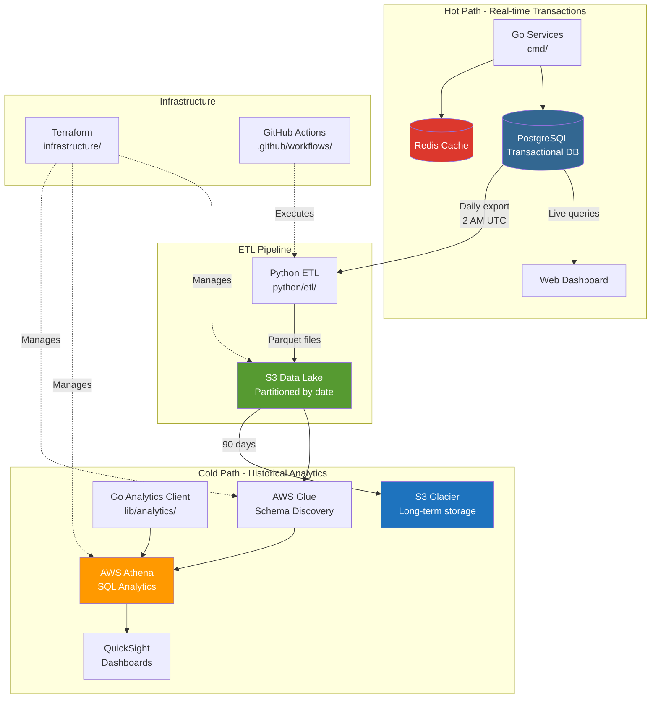

# Hybrid Architecture: PostgreSQL + AWS Athena

## Overview

Tokyo-IA implements a hybrid data architecture that combines **PostgreSQL** for transactional workloads (hot data) with **AWS Athena** for analytical queries on historical data (cold data). This architecture optimizes both performance and cost.

## Architecture Diagram



## Architecture Decisions

### Why Hybrid?

| Aspect | PostgreSQL (Hot) | Athena (Cold) |
|--------|------------------|---------------|
| **Use Case** | Real-time operations | Historical analytics |
| **Data Age** | Last 30-90 days | 90+ days |
| **Query Pattern** | OLTP, point queries | OLAP, aggregations |
| **Latency** | <100ms | 1-5 seconds |
| **Cost** | Higher (compute always on) | Lower (pay per query) |
| **Scalability** | Vertical | Horizontal (S3) |

### Key Benefits

1. **Cost Optimization**: ~75% reduction in storage costs using Parquet + S3 Glacier
2. **Performance**: Fast queries for recent data, efficient scans for analytics
3. **Scalability**: S3 provides unlimited storage capacity
4. **Flexibility**: SQL queries on both hot and cold data
5. **Compliance**: Long-term data retention in cost-effective storage

## Data Flow

### 1. Write Path (Real-time)

```
User Request → Go Service → PostgreSQL → Redis Cache → Response
                                ↓
                        Audit Log (async)
```

### 2. ETL Path (Daily)

```
PostgreSQL → Python ETL → S3 (Parquet) → Glue Crawler → Athena
    ↓
Retention Policy:
- 0-30 days: PostgreSQL only
- 30-90 days: PostgreSQL + S3
- 90+ days: S3 only
```

### 3. Query Path (Analytics)

```
Go Analytics Client → Athena → S3 Data Lake → Results
         ↓
    Cache results
```

## Component Details

### Hot Data Layer (PostgreSQL)

**Purpose**: Transactional database for real-time operations

**Tables**:
- `agents` - Agent registry
- `workflows` - Active workflows (last 30 days)
- `agent_tasks` - Recent task executions
- `agent_metrics` - Real-time performance metrics
- `user_sessions` - Active user sessions

**Retention**: 30-90 days

**Backup**: Daily automated backups

### Cold Data Layer (AWS Athena)

**Purpose**: Analytics on historical data

**Data Format**: 
- Parquet files with Snappy compression
- Partitioned by year/month/day
- Schema managed by AWS Glue

**Tables**:
- `workflows` - Historical workflows
- `agent_tasks` - Historical task executions
- `agent_metrics` - Historical metrics
- `agent_interactions` - Agent communication logs
- `user_sessions` - Historical sessions

**Query Engine**: AWS Athena (Presto-based)

**Cost**: $5 per TB scanned (~$0.005 per GB)

### ETL Pipeline

**Language**: Python 3.11+

**Schedule**: Daily at 2 AM UTC (GitHub Actions)

**Process**:
1. Extract data from PostgreSQL (previous day)
2. Transform to Parquet format
3. Partition by year/month/day
4. Upload to S3
5. Update Glue catalog
6. Validate data integrity

**Error Handling**:
- Automatic retries (3 attempts)
- Slack/Email notifications on failure
- Manual recovery scripts available

### Storage Strategy

**S3 Data Lake**:
```
s3://tokyo-ia-data-lake-{env}/
├── workflows/
│   └── year=2024/
│       └── month=12/
│           └── day=22/
│               └── data.parquet
├── agent_tasks/
├── agent_metrics/
├── agent_interactions/
└── user_sessions/
```

**Lifecycle Policies**:
- 0-90 days: S3 Standard
- 90-365 days: S3 Glacier
- 365+ days: S3 Glacier Deep Archive
- 730+ days: Deletion (configurable)

## Performance Characteristics

### PostgreSQL Queries

- Point queries: <10ms
- Range queries: <100ms
- Aggregations: <500ms
- Concurrent connections: 100+

### Athena Queries

- Simple aggregations: 1-3 seconds
- Complex joins: 5-15 seconds
- Full table scans: 15-60 seconds
- Data scanned: 10MB - 10GB typical

## Cost Analysis

### Monthly Costs (Estimated)

| Service | Usage | Cost |
|---------|-------|------|
| PostgreSQL RDS | db.t3.medium | ~$50/month |
| S3 Standard (100GB) | Storage | ~$2.30/month |
| S3 Glacier (1TB) | Long-term storage | ~$4/month |
| Athena | 1TB scanned | ~$5/month |
| Glue Crawler | Daily runs | ~$0.44/month |
| Data Transfer | Minimal | ~$1/month |
| **Total** | | **~$62/month** |

**Savings vs Pure PostgreSQL**: 60-70% reduction

### Cost Optimization Tips

1. **Partition Pruning**: Always filter by year/month/day
2. **Column Selection**: Avoid `SELECT *`
3. **Parquet Format**: Already implemented (~75% compression)
4. **Result Caching**: Reuse results within 24 hours
5. **Workgroup Configuration**: Set data scan limits

## Security

### Data at Rest

- S3: AES-256 encryption
- RDS: Encrypted volumes
- Glacier: Encrypted archives

### Data in Transit

- TLS 1.3 for all connections
- VPC endpoints for AWS services
- No public S3 bucket access

### Access Control

- IAM roles with least privilege
- Separate roles for ETL and queries
- MFA for production access
- Audit logging enabled

## Monitoring

### Metrics Collected

**ETL Pipeline**:
- Rows exported per table
- Export duration
- S3 upload size
- Error rates

**Athena Queries**:
- Query execution time
- Data scanned
- Query cost
- Error rates

**Storage**:
- S3 bucket size
- Growth rate
- Lifecycle transitions

### Alerts

- ETL failure (immediate)
- Query cost spike (hourly)
- Storage quota reached (daily)
- Partition lag (daily)

## Disaster Recovery

### Backup Strategy

**PostgreSQL**:
- Automated daily snapshots
- 30-day retention
- Point-in-time recovery (7 days)

**S3 Data Lake**:
- Versioning enabled
- Cross-region replication (optional)
- Lifecycle policies prevent accidental deletion

### Recovery Procedures

1. **ETL Failure**: Run manual backfill script
2. **Data Corruption**: Restore from S3 versions
3. **PostgreSQL Failure**: Restore from snapshot
4. **Complete Disaster**: Restore from cross-region backup

**RTO**: <4 hours  
**RPO**: <24 hours

## Comparison with Alternatives

### vs. Pure PostgreSQL

**Pros**:
- Lower storage costs (60-70%)
- Better for analytics workloads
- Scales to petabytes

**Cons**:
- Higher query latency for analytics
- More complex architecture
- Two systems to maintain

### vs. Data Warehouse (Redshift/BigQuery)

**Pros**:
- Lower costs for sporadic queries
- No cluster management
- Simpler architecture

**Cons**:
- Higher latency
- Limited concurrent users
- No streaming ingestion

### vs. NoSQL (DynamoDB)

**Pros**:
- SQL interface
- Better for analytics
- Structured schema

**Cons**:
- Less flexible data model
- Higher operational overhead
- Relational constraints

## Future Enhancements

1. **Real-time Analytics**: Add Kinesis → Athena Federation
2. **Materialized Views**: Pre-aggregate common queries
3. **Partition Projection**: Auto-generate partitions
4. **Query Acceleration**: Enable Athena query result caching
5. **Cost Attribution**: Tag queries by team/project
6. **ML Integration**: SageMaker with Athena data

## References

- [AWS Athena Documentation](https://docs.aws.amazon.com/athena/)
- [PostgreSQL Best Practices](https://www.postgresql.org/docs/current/performance-tips.html)
- [Parquet Format Specification](https://parquet.apache.org/docs/)
- [AWS Glue Documentation](https://docs.aws.amazon.com/glue/)
- [Cost Optimization Guide](https://aws.amazon.com/athena/pricing/)

## Related Documentation

- [Athena Setup Guide](./ATHENA_SETUP.md)
- [ETL Pipeline Documentation](./ETL_PIPELINE.md)
- [Analytics Client Usage](./ANALYTICS_GUIDE.md)
- [Infrastructure Guide](../infrastructure/README.md)
