# Hybrid Architecture: PostgreSQL + AWS Athena

## Overview

Tokyo-IA implements a hybrid data architecture that combines:
- **PostgreSQL**: Hot path for real-time transactional operations
- **AWS Athena**: Cold path for analytics and historical reporting

This architecture provides the best of both worlds: fast transactional performance and cost-effective analytics at scale.

## Architecture Diagram

```mermaid
graph TB
    subgraph "Hot Data - Transaccional"
        App[Go Services<br/>cmd/ & lib/] --> PG[(PostgreSQL<br/>PLpgSQL)]
        App --> Redis[(Redis Cache)]
    end
    
    subgraph "ETL Pipeline"
        PG -->|Exportación diaria| ETL[Python ETL<br/>export_to_s3.py]
        ETL -->|Parquet| S3[S3 Data Lake<br/>Particionado]
        S3 --> Glue[AWS Glue<br/>Data Catalog]
    end
    
    subgraph "Cold Data - Analytics"
        Glue --> Athena[AWS Athena<br/>Queries SQL]
        App --> AthenaClient[Go Athena Client<br/>lib/analytics/]
        AthenaClient --> Athena
        Python[Python Scripts<br/>Data Science] --> Athena
        Athena --> Results[S3 Query Results]
    end
    
    style PG fill:#336791,color:#fff
    style Athena fill:#FF9900,color:#fff
    style Redis fill:#DC382D,color:#fff
    style S3 fill:#569A31,color:#fff
```

## Components

### 1. Hot Path: PostgreSQL

**Purpose**: Real-time transactional operations

**Use Cases**:
- Create/update invoices
- Process payments
- User management
- Real-time queries (&lt;100ms latency)

**Characteristics**:
- ACID compliance
- Low latency reads/writes
- Limited retention (90 days hot data)

### 2. ETL Pipeline: Python

**Purpose**: Daily data export from PostgreSQL to S3

**Key Features**:
- Incremental and full export modes
- Parquet format with Snappy compression
- Partitioning by date (year/month/day)
- Retry logic and error handling
- CloudWatch logging

**Schedule**: Runs daily at 2 AM UTC via GitHub Actions

### 3. Cold Path: AWS Athena

**Purpose**: Analytics and historical reporting

**Use Cases**:
- Monthly revenue reports
- Customer lifetime value analysis
- Product revenue breakdown
- Retention analysis
- Long-term trend analysis

**Characteristics**:
- Serverless, pay-per-query
- SQL interface
- Petabyte-scale capability
- 2-5 second query latency

## Data Flow

1. **Application writes** to PostgreSQL (hot path)
2. **Daily ETL** exports data from PostgreSQL
3. **Data lands** in S3 Data Lake as Parquet files
4. **AWS Glue** maintains metadata catalog
5. **Athena queries** run against S3 data
6. **Go services** consume analytics via Athena client

## Hot Path vs Cold Path Decision Matrix

| Criterion | PostgreSQL (Hot) | Athena (Cold) |
|-----------|------------------|---------------|
| **Latency** | &lt;100ms | 2-5 seconds |
| **Data Age** | Last 90 days | Unlimited |
| **Query Type** | Point queries, updates | Analytics, aggregations |
| **Cost** | Fixed (instance) | Pay per query |
| **Scale** | Vertical | Horizontal (unlimited) |
| **Use When** | Real-time needs | Historical analysis |

## Trade-offs and Design Decisions

### Why Parquet?
- **70-90% compression** vs CSV
- **Columnar format** enables efficient analytics
- **Schema evolution** support
- **Native Athena support**

### Why Partition by Date?
- **Query cost reduction**: Only scan relevant partitions
- **Performance**: Faster queries with partition pruning
- **Organization**: Clear data organization

### Why Daily ETL?
- **Balance**: Fresh enough for analytics, not too frequent
- **Cost**: Minimizes data transfer costs
- **Reliability**: Time for retries if failures occur

### Why Separate Buckets?
- **Data Lake**: Long-term storage with lifecycle policies
- **Query Results**: Temporary, cleaned up after 30 days
- **Security**: Different access patterns and policies

## Performance Characteristics

### PostgreSQL
- **Read latency**: 10-50ms
- **Write latency**: 20-100ms
- **Throughput**: 10,000+ TPS

### Athena
- **Query latency**: 2-5 seconds (warm cache: &lt;1s)
- **Data scan**: ~5GB/second
- **Cost**: $5 per TB scanned

## Cost Optimization

1. **Partitioning**: Reduces data scanned per query
2. **Parquet**: 70-90% smaller than CSV
3. **Result caching**: Reuse results within 24 hours
4. **Lifecycle policies**: Archive old data to Glacier
5. **Query optimization**: Use WHERE clauses with partitions

## Monitoring and Observability

### Key Metrics

**ETL Pipeline**:
- Export success rate
- Export duration
- Data volume exported
- Error rate

**Athena Queries**:
- Query execution time
- Data scanned per query
- Query success rate
- Cost per query

### Alerts

- ETL failure
- Query timeout (&gt;30s)
- High scan cost (&gt;$10 per query)
- S3 storage threshold

## Security

1. **Encryption at rest**: SSE-S3 for all buckets
2. **IAM roles**: Least privilege access
3. **Audit logs**: CloudWatch Logs for all operations
4. **Network**: VPC endpoints for S3/Athena access
5. **Secrets**: Never commit credentials

## Scaling Considerations

### Current Scale
- **Data volume**: ~10GB/day
- **Query frequency**: ~100 queries/day
- **Retention**: 2 years in S3

### Scale Limits
- **PostgreSQL**: Vertical scaling to ~1TB
- **Athena**: No practical limit
- **S3**: No practical limit

### When to Scale
- **PostgreSQL**: When dataset &gt;500GB
- **ETL**: If exports take &gt;30 minutes
- **Athena**: If queries cost &gt;$100/day

## Future Enhancements

1. **Streaming ETL**: Use AWS DMS for real-time replication
2. **Data Lake**: Add Bronze/Silver/Gold layers
3. **Machine Learning**: Integration with SageMaker
4. **Real-time Analytics**: Add Kinesis Analytics
5. **Data Quality**: Implement Great Expectations

## References

- [AWS Athena Documentation](https://docs.aws.amazon.com/athena/)
- [Parquet Format](https://parquet.apache.org/)
- [AWS Glue Data Catalog](https://docs.aws.amazon.com/glue/)
- [PostgreSQL Best Practices](https://www.postgresql.org/docs/)
