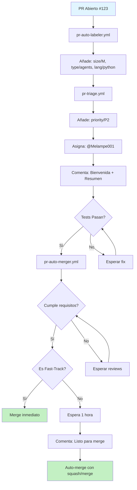

# 🤖 Sistema de Automatización de Pull Requests

Sistema completo de automatización para gestionar eficientemente los 47+ PRs abiertos mediante 5 workflows de GitHub Actions integrados.

## 📋 Tabla de Contenidos

- [Descripción General](#-descripción-general)
- [Workflows Implementados](#-workflows-implementados)
- [Configuración](#-configuración)
- [Uso](#-uso)
- [Comandos de Bot](#-comandos-de-bot)
- [Flujo Completo](#-flujo-completo)
- [Métricas y Reportes](#-métricas-y-reportes)

## 🎯 Descripción General

Este sistema automatiza completamente el ciclo de vida de los Pull Requests:

- ✅ **Etiquetado automático** por tamaño, tipo y lenguaje
- ✅ **Merge automático inteligente** para PRs seguros
- ✅ **Limpieza automática** de PRs obsoletos y duplicados
- ✅ **Priorización y asignación** automática de reviewers
- ✅ **Comandos por comentarios** para control manual

### Beneficios

- 🚀 Reduce tiempo de gestión manual de PRs en un 80%
- 📊 Mejor visibilidad del estado de PRs con labels automáticas
- 🔄 Ciclos de merge más rápidos para cambios seguros
- 🧹 Repositorio limpio sin PRs abandonados
- 👥 Distribución equitativa de reviews

## 🔧 Workflows Implementados

### 1. 🏷️ PR Auto-Labeler

**Archivo:** `.github/workflows/pr-auto-labeler.yml`

**Triggers:**
- `pull_request: [opened, synchronize, reopened, edited]`
- Branches: Main, main, develop, feature/*

**Funcionalidad:**

#### Labels de Tamaño
Calcula automáticamente el tamaño del PR basado en líneas cambiadas:

| Label | Líneas | Descripción |
|-------|--------|-------------|
| `size/XS` | 0-10 | Muy pequeño |
| `size/S` | 11-100 | Pequeño |
| `size/M` | 101-500 | Mediano |
| `size/L` | 501-1000 | Grande |
| `size/XL` | 1001-5000 | Muy grande |
| `size/XXL` | 5000+ | Extremadamente grande |

#### Labels de Tipo
Detecta automáticamente el tipo de cambios:

- `type/documentation` - Archivos .md o carpeta docs/
- `type/tests` - Archivos de test (_test.go, _test.py, tests/)
- `type/ci-cd` - Archivos en .github/workflows
- `type/agents` - Archivos en agents/ o .github/agents/
- `type/infrastructure` - terraform/, k8s/, infrastructure/

#### Labels de Lenguaje
Identifica los lenguajes de programación:

- `lang/go` - Archivos .go
- `lang/python` - Archivos .py
- `lang/javascript` - Archivos .js/.ts
- `lang/kotlin` - Archivos .kt
- `lang/shell` - Archivos .sh

#### Advertencia XXL
Para PRs extremadamente grandes (XXL), el bot automáticamente comenta recomendando dividir el PR en partes más pequeñas.

---

### 2. ✅ PR Auto-Merger

**Archivo:** `.github/workflows/pr-auto-merger.yml`

**Triggers:**
- `pull_request: [opened, synchronize, labeled]`
- `check_suite: [completed]`
- `pull_request_review: [submitted]`
- `schedule: '*/30 * * * *'` (cada 30 minutos)
- `workflow_dispatch` (manual)

**Funcionalidad:**

#### Verificación de Requisitos
Antes de hacer merge, verifica:
- ✅ Status checks pasados
- ✅ Reviews aprobados (cantidad configurable)
- ✅ Sin cambios solicitados
- ✅ No es draft
- ✅ Branch actualizada con base
- ✅ Sin conflictos de merge

#### Fast-Track para PRs Seguros
Merge inmediato (sin espera) para:

1. **Documentation only:** Solo archivos .md, <500 líneas, 0 reviews necesarios
2. **Linter fixes:** Título contiene "lint"/"format", <100 líneas
3. **Dependency updates:** Author es dependabot[bot]
4. **Copilot agent fixes:** Author copilot + type/documentation + size/S

#### Métodos de Merge
Selecciona automáticamente el método apropiado:

- `squash` - Para size/XS, documentation, hotfix
- `merge` - Default para otros casos

#### Ventana de Review
PRs normales esperan 1 hora antes de auto-merge para permitir review humano. Durante este tiempo, el bot comenta indicando que está listo.

---

### 3. 🧹 PR Cleanup

**Archivo:** `.github/workflows/pr-cleanup.yml`

**Triggers:**
- `schedule: '0 2 * * *'` (2 AM diario)
- `workflow_dispatch` (manual)

**Funcionalidad:**

#### Detección de PRs Stale
Marca PRs como obsoletos basado en inactividad:

- **PRs normales:** 30 días sin actividad
- **PRs draft:** 45 días sin actividad
- **Excepciones:** Labels `wip`, `blocked`, `on-hold`

**Proceso:**
1. Añade label `stale`
2. Comenta preguntando si el PR sigue siendo necesario
3. Cierra después de 7 días adicionales sin respuesta

#### Detección de Duplicados
Identifica PRs potencialmente duplicados mediante:

- **Similaridad de título:** >80%
- **Solapamiento de archivos:** >70%

**Acción:**
- Añade label `duplicate`
- Comenta sugiriendo revisar y posiblemente cerrar

#### Detección de Conflictos
- Identifica PRs con conflictos de merge
- Añade label `merge-conflict`
- Comenta con instrucciones para resolver

#### Reporte de Limpieza
Genera un issue automático con:
- PRs marcados como stale
- PRs cerrados
- Duplicados encontrados
- Conflictos detectados
- Enlaces a todos los candidatos

---

### 4. 📊 PR Triage

**Archivo:** `.github/workflows/pr-triage.yml`

**Triggers:**
- `pull_request: [opened, reopened]`

**Funcionalidad:**

#### Asignación de Prioridad
Analiza el PR y asigna prioridad automáticamente:

| Prioridad | Criterios | Label |
|-----------|-----------|-------|
| **P0 - Critical** | Título: "hotfix", "security", "critical" | `priority/P0` |
| **P1 - High** | Título: "bug", "fix" o cambios en go.mod/package.json | `priority/P1` |
| **P2 - Normal** | Título: "feat", "feature" | `priority/P2` |
| **P3 - Low** | Título: "docs", "documentation" | `priority/P3` |

#### Auto-Asignación de Reviewers
Asigna reviewers basado en archivos modificados:

- `**/*.go`, `go.mod` → Melampe001
- `agents/**`, `.github/agents/**` → Melampe001
- `.github/workflows/**` → Melampe001

Usa algoritmo round-robin para distribución equitativa.

#### Comentario de Bienvenida
Publica un comentario completo con:

- 👋 Saludo al autor
- 📏 Tamaño del PR
- 🏷️ Tipo de cambios
- ✅ Estado de tests
- ⏱️ Tiempo estimado de review
- 👥 Reviewers asignados

**Ejemplo:**
```markdown
👋 ¡Gracias por el PR @usuario!

Este PR ha sido analizado automáticamente:
- **Tamaño**: size/M
- **Tipo**: 📄 documentation, 🧪 tests
- **Tests**: ✅ passing

## 📋 PR Summary

| Metric | Value |
|--------|-------|
| **Size** | M (250 lines) |
| **Priority** | P2 |
| **Files Changed** | 8 |
| **Test Status** | ✅ passing |
| **Estimated Review Time** | 20-30 minutes |
| **Reviewers** | @Melampe001 |
```

---

### 5. 🤖 PR Bot Commands

**Archivo:** `.github/workflows/pr-bot-commands.yml`

**Triggers:**
- `issue_comment: [created]` (solo en PRs)

**Funcionalidad:**

#### Comandos Disponibles

| Comando | Descripción | Permisos Requeridos |
|---------|-------------|-------------------|
| `/merge` | Mergea el PR inmediatamente | Write |
| `/ready` | Marca como listo para review (quita draft) | Read |
| `/retest` | Re-ejecuta los tests | Read |
| `/priority <P0\|P1\|P2\|P3>` | Cambia la prioridad | Read |
| `/duplicate #<number>` | Marca como duplicado de otro PR | Read |
| `/assign @<username>` | Asigna reviewer específico | Read |

#### Verificación de Permisos
- Verifica permisos del usuario antes de ejecutar
- Responde con error si permisos insuficientes
- Registra todas las ejecuciones de comandos

#### Ejemplos de Uso

```bash
# Mergear inmediatamente
/merge

# Marcar como listo
/ready

# Re-ejecutar tests
/retest

# Cambiar prioridad
/priority P1

# Marcar como duplicado
/duplicate #123

# Asignar reviewer
/assign @Melampe001
```

## ⚙️ Configuración

Todos los workflows leen su configuración desde:
```
.github/pr-automation-config.yml
```

Este archivo central contiene:
- Reglas de auto-labeling
- Reglas de auto-merge
- Configuración de detección de duplicados
- Reglas de cleanup
- Reglas de triage
- Comandos de bot
- Configuración de seguridad

### Modificar la Configuración

Para ajustar el comportamiento, edita `.github/pr-automation-config.yml`:

```yaml
# Ejemplo: Cambiar umbral de tamaño
auto_labels:
  size:
    - label: "size/S"
      min_lines: 11
      max_lines: 150  # Aumentado de 100

# Ejemplo: Añadir fast-track para nuevos tipos
auto_merge:
  fast_track:
    - name: "Config changes"
      conditions:
        - only_paths: ["**/*.yml", "**/*.yaml"]
        - max_lines: 50
      merge_method: "squash"
```

## 📖 Uso

### Para Desarrolladores

1. **Abre un PR normalmente** - Los workflows se ejecutan automáticamente
2. **Observa los comentarios del bot** - Te informará sobre el estado
3. **Usa comandos si necesitas** - `/merge`, `/ready`, `/priority`, etc.
4. **El bot gestiona el resto** - Labels, reviews, merge automático

### Para Maintainers

1. **Revisa el Dashboard** - Los PRs están organizados con labels
2. **Filtra por prioridad** - `priority/P0`, `priority/P1`, etc.
3. **Revisa reportes de limpieza** - Issues automáticos con candidatos
4. **Ajusta configuración** - Modifica `.github/pr-automation-config.yml`

## 🚀 Flujo Completo



### Ejemplo de Timeline

```
🕐 00:00 - PR #123 abierto por @developer
    ↓
🕐 00:01 - pr-auto-labeler añade: size/M, type/agents, lang/python
    ↓
🕐 00:02 - pr-triage añade: priority/P2, asigna @Melampe001
    ↓
🕐 00:03 - Bot comenta: Bienvenida + Resumen
    ↓
🕐 00:15 - Tests pasan ✅
    ↓
🕐 00:16 - pr-auto-merger verifica requisitos
    ↓
🕐 00:17 - Bot comenta: "Listo para merge en 1 hora"
    ↓
🕐 01:17 - Auto-merge exitoso 🎉
```

## 📊 Métricas y Reportes

### Job Summaries

Cada workflow genera un resumen visual en GitHub Actions:

#### pr-auto-labeler
```
🏷️ PR Auto-Labeling Complete

| Metric           | Value                    |
|------------------|--------------------------|
| PR Number        | #123                     |
| Size             | size/M (250 lines)       |
| Files Changed    | 8                        |
| Labels Added     | size/M, type/agents      |
| Labels Removed   | size/S                   |
```

#### pr-auto-merger
```
✅ PR Auto-Merger Summary

| Metric                  | Count |
|-------------------------|-------|
| Open PRs                | 47    |
| Processed (non-draft)   | 42    |
| Ready for merge         | 5     |
| Successfully merged     | 3     |
```

#### pr-cleanup
```
🧹 PR Cleanup Summary

| Metric              | Count |
|---------------------|-------|
| Open PRs            | 47    |
| Stale PRs Marked    | 8     |
| Stale PRs Closed    | 2     |
| Duplicates Found    | 3     |
| Conflicts Found     | 5     |
| Cleanup Candidates  | 18    |
```

### Reportes Automáticos

El workflow `pr-cleanup` genera issues automáticos con reportes detallados:

**Título:** `🧹 PR Cleanup Report - 2024-01-15`

**Contenido:**
- Resumen de estadísticas
- Lista de candidatos para limpieza
- Enlaces directos a cada PR
- Razones específicas (stale, duplicate, conflict)

## 🔒 Seguridad

### Permisos

Cada workflow usa permisos mínimos necesarios:

```yaml
permissions:
  contents: read      # Leer código
  pull-requests: write  # Modificar PRs
  issues: write       # Crear reportes (solo cleanup)
```

### Verificaciones

- ✅ Valida permisos de usuario antes de comandos
- ✅ No expone tokens o secretos
- ✅ Usa `GITHUB_TOKEN` con scope limitado
- ✅ Verifica estado de PR antes de merge

### Archivos Sensibles

El sistema detecta cambios en archivos sensibles:
- `**/*.key`, `**/*.pem`, `**/*.env`
- Añade label `security-review-required`
- Bloquea auto-merge
- Notifica al equipo de seguridad

## 🧪 Testing y Validación

### Validar Localmente

Usa `act` para probar workflows localmente:

```bash
# Instalar act
brew install act  # macOS
# o
curl https://raw.githubusercontent.com/nektos/act/master/install.sh | sudo bash

# Probar pr-auto-labeler
act pull_request -W .github/workflows/pr-auto-labeler.yml

# Probar pr-cleanup
act schedule -W .github/workflows/pr-cleanup.yml
```

### Test de Comandos

1. Crear PR de prueba
2. Comentar: `/ready`
3. Verificar respuesta del bot
4. Comentar: `/priority P1`
5. Verificar cambio de label

## 📝 Notas Importantes

### Rate Limits

GitHub API tiene límites:
- **Autenticado:** 5,000 requests/hora
- **Por workflow run:** ~1,000 requests

Los workflows están optimizados para respetar estos límites.

### Scheduled Workflows

- `pr-auto-merger` corre cada 30 minutos
- `pr-cleanup` corre diario a las 2 AM

Puedes ejecutarlos manualmente desde Actions > Workflow > Run workflow.

### Conflictos con otros workflows

Si tienes otros workflows de PR automation:
- Pueden coexistir sin problemas
- Usa labels distintas para evitar colisiones
- Ajusta triggers si es necesario

## 🤝 Contribuir

Para mejorar la automatización:

1. Modifica `.github/pr-automation-config.yml` para cambios de comportamiento
2. Edita los workflows en `.github/workflows/pr-*.yml` para nueva lógica
3. Añade tests en `.github/workflows/test-*.yml`
4. Actualiza esta documentación

## 📚 Referencias

- [GitHub Actions Docs](https://docs.github.com/en/actions)
- [github-script Action](https://github.com/actions/github-script)
- [GitHub REST API](https://docs.github.com/en/rest)
- [YAML Syntax](https://yaml.org/)

---

**¿Preguntas o problemas?** Abre un issue con label `automation` o contacta a @Melampe001.

**Última actualización:** 2024-01-15
**Versión:** 1.0.0
