# 🤖 Tokyo-IA Agents Guide / Guía de Agentes Tokyo-IA

## 📋 Table of Contents / Tabla de Contenidos

- [English](#english)
  - [Overview](#overview)
  - [Agent Roles Table](#agent-roles-table)
  - [Execution Examples](#execution-examples)
  - [Workflow Diagram](#workflow-diagram)
  - [Prerequisites](#prerequisites)
- [Español](#español)
  - [Descripción General](#descripción-general)
  - [Tabla de Roles de Agentes](#tabla-de-roles-de-agentes)
  - [Ejemplos de Ejecución](#ejemplos-de-ejecución)
  - [Diagrama de Flujo](#diagrama-de-flujo)
  - [Requisitos Previos](#requisitos-previos)

---

# English

## Overview

Tokyo-IA includes four specialized executor agents that work together to analyze Flutter applications and generate cross-platform native code. Each agent has a specific role in the pipeline:

1. **Brand Agent** (`brand_executor.sh`) - Extracts design tokens and brand guidelines
2. **UX Agent** (`ux_executor.sh`) - Analyzes navigation patterns and user flows
3. **Bridge Agent** (`bridge_executor.sh`) - Creates widget-to-platform mappings
4. **AutoDev Agent** (`autodev_executor.sh`) - Generates native code for Android, iOS, and Web

These agents work in sequence, with each agent building upon the output of previous agents.

## Agent Roles Table

| Agent | File | Role | Primary Inputs | Outputs | Purpose |
|-------|------|------|----------------|---------|---------|
| 🎨 **Brand** | `agents/brand_executor.sh` | Design Token Extractor | `simulator/output/design_model.json`<br/>`flutter_app/lib/main.dart` | `simulator/output/brand_tokens.json` | Extracts brand identity including colors, typography, spacing, elevation, and border radius from Flutter app theme |
| 🧭 **UX** | `agents/ux_executor.sh` | Navigation & Flow Analyzer | `simulator/output/design_model.json`<br/>`flutter_app/lib/**/*.dart` | `simulator/output/ux_flow.json` | Analyzes navigation patterns, state management, user flows, state machines, and interaction types |
| 🌉 **Bridge** | `agents/bridge_executor.sh` | Platform Mapping Generator | N/A (generates from templates) | `simulator/output/platform_bridge.json` | Creates comprehensive widget-to-platform mappings for Android, iOS, and Web components |
| 🤖 **AutoDev** | `agents/autodev_executor.sh` | Native Code Generator | `simulator/output/platform_bridge.json`<br/>`simulator/output/brand_tokens.json` | `output/android/**`<br/>`output/ios/**`<br/>`output/web/**` | Generates production-ready native code for all three platforms using bridge mappings and brand tokens |

### Detailed Agent Descriptions

#### 🎨 Brand Agent

**Responsibilities:**
- Extract color palette from Flutter theme
- Define typography hierarchy (headings, body, captions)
- Set spacing scale (xs, sm, md, base, lg, xl, 2xl, 3xl)
- Define elevation levels (none, low, medium, high, highest)
- Establish border radius scale (sm, md, lg, xl, full)

**Output Schema:**
```json
{
  "project_name": "string",
  "generated_at": "ISO 8601 timestamp",
  "colors": { "primary": "#HEX", "secondary": "#HEX", ... },
  "typography": { "heading1": {...}, "body1": {...}, ... },
  "spacing": { "xs": 4, "sm": 8, ... },
  "elevation": { "none": 0, "low": 2, ... },
  "border_radius": { "sm": 4, "md": 8, ... }
}
```

#### 🧭 UX Agent

**Responsibilities:**
- Detect navigation type (imperative, named_routes, declarative)
- Count navigation patterns (push, pop, replace operations)
- Identify state management approach (setState, Provider, Riverpod, BLoC)
- Map user flows and state machines
- Detect interaction types (tap, long_press, drag, gesture, text_input)

**Output Schema:**
```json
{
  "generated_at": "ISO 8601 timestamp",
  "navigation": { "type": "string", "routes": [...], "patterns": {...} },
  "state_management": { "type": "string", "stateful_widgets": number },
  "user_flow": { "entry_point": "string", "primary_actions": [...] },
  "state_machine": { "states": [...], "transitions": [...] },
  "interactions": ["tap", "long_press", ...]
}
```

#### 🌉 Bridge Agent

**Responsibilities:**
- Map Flutter widgets to Android components
- Map Flutter widgets to iOS components  
- Map Flutter widgets to Web HTML elements
- Provide state management equivalents per platform
- Define navigation pattern mappings per platform

**Output Schema:**
```json
{
  "generated_at": "ISO 8601 timestamp",
  "version": "1.0.0",
  "widget_mappings": {
    "WidgetName": {
      "android": { "component": "...", "package": "...", "description": "..." },
      "ios": { "component": "...", "framework": "...", "description": "..." },
      "web": { "component": "...", "tag": "...", "description": "..." }
    }
  },
  "state_management_mappings": {...},
  "navigation_mappings": {...}
}
```

#### 🤖 AutoDev Agent

**Responsibilities:**
- Generate Android Kotlin code (MainActivity, XML layouts)
- Generate iOS Swift code (ViewControllers, UI setup)
- Generate Web React/TypeScript code (Components, CSS)
- Apply brand tokens to generated code
- Implement navigation patterns per platform
- Create production-ready, compilable code

**Environment Variables:**
- `TARGET_PLATFORM`: `all` (default), `android`, `ios`, or `web`

## Execution Examples

### Example 1: Full Pipeline Execution

Execute all agents in sequence to generate complete cross-platform code:

```bash
# Step 1: Extract brand tokens
cd /path/to/tokyo-ia
bash agents/brand_executor.sh

# Output:
# ✓ Found design model
#   Project: MyFlutterApp
# 🎨 Extracting brand colors...
#   ✓ Extracted colors from theme
#     Primary: #673AB7
#     Secondary: #9C27B0
# ✅ Brand tokens generated successfully!
# 📄 Output: simulator/output/brand_tokens.json

# Step 2: Analyze UX patterns
bash agents/ux_executor.sh

# Output:
# ✓ Found design model
#   State Management: setState
#   Routes: 3
# 🔍 Analyzing navigation patterns...
#   Navigator.push: 2
#   pushNamed: 5
#   Navigator.pop: 4
# 🎮 Detecting interaction types...
#   Interactions: tap,text_input
# ✅ UX flow generated successfully!
# 📄 Output: simulator/output/ux_flow.json

# Step 3: Generate platform mappings
bash agents/bridge_executor.sh

# Output:
# 📝 Generating platform bridge mappings...
# ✅ Platform bridge generated successfully!
# 📄 Output: simulator/output/platform_bridge.json

# Step 4: Generate native code for all platforms
bash agents/autodev_executor.sh

# Output:
# Target Platform: all
# ✓ Found platform bridge and brand tokens
#   Project: MyFlutterApp
#   Primary Color: #673AB7
# 📱 Generating Android code...
#   ✓ MainActivity.kt
#   ✓ activity_main.xml
# 🍎 Generating iOS code...
#   ✓ MainViewController.swift
# 🌐 Generating Web code...
#   ✓ App.tsx
#   ✓ App.css
# ✅ Code generation complete!
```

### Example 2: Generate Code for Specific Platform Only

Generate native code for Android only:

```bash
# Execute full pipeline first
bash agents/brand_executor.sh
bash agents/ux_executor.sh
bash agents/bridge_executor.sh

# Generate Android code only
TARGET_PLATFORM=android bash agents/autodev_executor.sh

# Output files:
# output/android/MainActivity.kt
# output/android/activity_main.xml
```

### Example 3: Re-generate After Design Changes

After updating your Flutter app theme or navigation:

```bash
# Re-run brand agent to extract updated colors
bash agents/brand_executor.sh

# Re-run UX agent to capture new navigation
bash agents/ux_executor.sh

# Bridge agent output is template-based (optional to re-run)
# bash agents/bridge_executor.sh

# Generate fresh native code with updates
bash agents/autodev_executor.sh
```

### Example 4: Inspect Agent Outputs

View the JSON outputs to understand what each agent extracted:

```bash
# View brand tokens
cat simulator/output/brand_tokens.json | jq .

# View UX flow analysis
cat simulator/output/ux_flow.json | jq .

# View platform mappings
cat simulator/output/platform_bridge.json | jq '.widget_mappings.Scaffold'

# Check generated Android code
cat output/android/MainActivity.kt
```

## Workflow Diagram

```mermaid
graph TD
    A[Flutter App] --> B[design_model.json]
    B --> C[🎨 Brand Agent]
    B --> D[🧭 UX Agent]
    
    C --> E[brand_tokens.json]
    D --> F[ux_flow.json]
    
    G[🌉 Bridge Agent] --> H[platform_bridge.json]
    
    E --> I[🤖 AutoDev Agent]
    F --> I
    H --> I
    
    I --> J[Android Code]
    I --> K[iOS Code]
    I --> L[Web Code]
    
    J --> M[MainActivity.kt<br/>activity_main.xml]
    K --> N[MainViewController.swift]
    L --> O[App.tsx<br/>App.css]
    
    style C fill:#ff9999
    style D fill:#99ccff
    style G fill:#99ff99
    style I fill:#ffcc99
```



## Prerequisites

### System Requirements

- **Bash**: Version 4.0 or higher
- **jq**: JSON processor for parsing and generating JSON
- **grep/sed**: For text processing (standard on Unix/Linux/macOS)
- **Flutter**: If analyzing an actual Flutter application

### Installation

#### Install jq (if not already installed)

**macOS:**
```bash
brew install jq
```

**Ubuntu/Debian:**
```bash
sudo apt-get install jq
```

**CentOS/RHEL:**
```bash
sudo yum install jq
```

### Directory Structure

The agents expect the following directory structure:

```
tokyo-ia/
├── agents/
│   ├── brand_executor.sh
│   ├── ux_executor.sh
│   ├── bridge_executor.sh
│   └── autodev_executor.sh
├── simulator/
│   └── output/
│       ├── design_model.json     (required input)
│       ├── brand_tokens.json     (generated by brand agent)
│       ├── ux_flow.json          (generated by ux agent)
│       └── platform_bridge.json  (generated by bridge agent)
├── flutter_app/
│   └── lib/
│       └── main.dart             (optional input for brand agent)
└── output/
    ├── android/
    ├── ios/
    └── web/
```

### Required Input Files

1. **`simulator/output/design_model.json`** - Must exist before running brand or UX agents
   - Contains project metadata, routes, state management info
   - Generated by the Tokyo-IA simulator/design tool

2. **`flutter_app/lib/main.dart`** (Optional) - Used by brand agent
   - If present, brand agent extracts actual theme colors
   - If absent, uses default purple theme

### Permissions

Ensure all agent scripts are executable:

```bash
chmod +x agents/*.sh
```

---

# Español

## Descripción General

Tokyo-IA incluye cuatro agentes ejecutores especializados que trabajan juntos para analizar aplicaciones Flutter y generar código nativo multiplataforma. Cada agente tiene un rol específico en el pipeline:

1. **Agente de Marca** (`brand_executor.sh`) - Extrae tokens de diseño y guías de marca
2. **Agente UX** (`ux_executor.sh`) - Analiza patrones de navegación y flujos de usuario
3. **Agente Puente** (`bridge_executor.sh`) - Crea mapeos de widgets a plataformas
4. **Agente AutoDev** (`autodev_executor.sh`) - Genera código nativo para Android, iOS y Web

Estos agentes trabajan en secuencia, donde cada agente construye sobre la salida de los agentes anteriores.

## Tabla de Roles de Agentes

| Agente | Archivo | Rol | Entradas Principales | Salidas | Propósito |
|--------|---------|-----|---------------------|---------|-----------|
| 🎨 **Brand** | `agents/brand_executor.sh` | Extractor de Tokens de Diseño | `simulator/output/design_model.json`<br/>`flutter_app/lib/main.dart` | `simulator/output/brand_tokens.json` | Extrae la identidad de marca incluyendo colores, tipografía, espaciado, elevación y radio de borde del tema de la app Flutter |
| 🧭 **UX** | `agents/ux_executor.sh` | Analizador de Navegación y Flujo | `simulator/output/design_model.json`<br/>`flutter_app/lib/**/*.dart` | `simulator/output/ux_flow.json` | Analiza patrones de navegación, gestión de estado, flujos de usuario, máquinas de estado y tipos de interacción |
| 🌉 **Bridge** | `agents/bridge_executor.sh` | Generador de Mapeo de Plataformas | N/A (genera desde plantillas) | `simulator/output/platform_bridge.json` | Crea mapeos completos de widgets a plataformas para componentes de Android, iOS y Web |
| 🤖 **AutoDev** | `agents/autodev_executor.sh` | Generador de Código Nativo | `simulator/output/platform_bridge.json`<br/>`simulator/output/brand_tokens.json` | `output/android/**`<br/>`output/ios/**`<br/>`output/web/**` | Genera código nativo listo para producción para las tres plataformas usando mapeos puente y tokens de marca |

### Descripciones Detalladas de Agentes

#### 🎨 Agente de Marca

**Responsabilidades:**
- Extraer paleta de colores del tema Flutter
- Definir jerarquía tipográfica (encabezados, cuerpo, subtítulos)
- Establecer escala de espaciado (xs, sm, md, base, lg, xl, 2xl, 3xl)
- Definir niveles de elevación (none, low, medium, high, highest)
- Establecer escala de radio de borde (sm, md, lg, xl, full)

**Esquema de Salida:**
```json
{
  "project_name": "string",
  "generated_at": "marca de tiempo ISO 8601",
  "colors": { "primary": "#HEX", "secondary": "#HEX", ... },
  "typography": { "heading1": {...}, "body1": {...}, ... },
  "spacing": { "xs": 4, "sm": 8, ... },
  "elevation": { "none": 0, "low": 2, ... },
  "border_radius": { "sm": 4, "md": 8, ... }
}
```

#### 🧭 Agente UX

**Responsabilidades:**
- Detectar tipo de navegación (imperativa, named_routes, declarativa)
- Contar patrones de navegación (operaciones push, pop, replace)
- Identificar enfoque de gestión de estado (setState, Provider, Riverpod, BLoC)
- Mapear flujos de usuario y máquinas de estado
- Detectar tipos de interacción (tap, long_press, drag, gesture, text_input)

**Esquema de Salida:**
```json
{
  "generated_at": "marca de tiempo ISO 8601",
  "navigation": { "type": "string", "routes": [...], "patterns": {...} },
  "state_management": { "type": "string", "stateful_widgets": número },
  "user_flow": { "entry_point": "string", "primary_actions": [...] },
  "state_machine": { "states": [...], "transitions": [...] },
  "interactions": ["tap", "long_press", ...]
}
```

#### 🌉 Agente Puente

**Responsabilidades:**
- Mapear widgets de Flutter a componentes Android
- Mapear widgets de Flutter a componentes iOS
- Mapear widgets de Flutter a elementos HTML Web
- Proporcionar equivalentes de gestión de estado por plataforma
- Definir mapeos de patrones de navegación por plataforma

**Esquema de Salida:**
```json
{
  "generated_at": "marca de tiempo ISO 8601",
  "version": "1.0.0",
  "widget_mappings": {
    "NombreWidget": {
      "android": { "component": "...", "package": "...", "description": "..." },
      "ios": { "component": "...", "framework": "...", "description": "..." },
      "web": { "component": "...", "tag": "...", "description": "..." }
    }
  },
  "state_management_mappings": {...},
  "navigation_mappings": {...}
}
```

#### 🤖 Agente AutoDev

**Responsabilidades:**
- Generar código Kotlin para Android (MainActivity, layouts XML)
- Generar código Swift para iOS (ViewControllers, configuración UI)
- Generar código React/TypeScript para Web (Componentes, CSS)
- Aplicar tokens de marca al código generado
- Implementar patrones de navegación por plataforma
- Crear código compilable listo para producción

**Variables de Entorno:**
- `TARGET_PLATFORM`: `all` (por defecto), `android`, `ios`, o `web`

## Ejemplos de Ejecución

### Ejemplo 1: Ejecución Completa del Pipeline

Ejecutar todos los agentes en secuencia para generar código multiplataforma completo:

```bash
# Paso 1: Extraer tokens de marca
cd /ruta/a/tokyo-ia
bash agents/brand_executor.sh

# Salida:
# ✓ Found design model
#   Project: MiAppFlutter
# 🎨 Extracting brand colors...
#   ✓ Extracted colors from theme
#     Primary: #673AB7
#     Secondary: #9C27B0
# ✅ Brand tokens generated successfully!
# 📄 Output: simulator/output/brand_tokens.json

# Paso 2: Analizar patrones UX
bash agents/ux_executor.sh

# Salida:
# ✓ Found design model
#   State Management: setState
#   Routes: 3
# 🔍 Analyzing navigation patterns...
#   Navigator.push: 2
#   pushNamed: 5
#   Navigator.pop: 4
# 🎮 Detecting interaction types...
#   Interactions: tap,text_input
# ✅ UX flow generated successfully!
# 📄 Output: simulator/output/ux_flow.json

# Paso 3: Generar mapeos de plataforma
bash agents/bridge_executor.sh

# Salida:
# 📝 Generating platform bridge mappings...
# ✅ Platform bridge generated successfully!
# 📄 Output: simulator/output/platform_bridge.json

# Paso 4: Generar código nativo para todas las plataformas
bash agents/autodev_executor.sh

# Salida:
# Target Platform: all
# ✓ Found platform bridge and brand tokens
#   Project: MiAppFlutter
#   Primary Color: #673AB7
# 📱 Generating Android code...
#   ✓ MainActivity.kt
#   ✓ activity_main.xml
# 🍎 Generating iOS code...
#   ✓ MainViewController.swift
# 🌐 Generating Web code...
#   ✓ App.tsx
#   ✓ App.css
# ✅ Code generation complete!
```

### Ejemplo 2: Generar Código para una Plataforma Específica

Generar código nativo solo para Android:

```bash
# Ejecutar el pipeline completo primero
bash agents/brand_executor.sh
bash agents/ux_executor.sh
bash agents/bridge_executor.sh

# Generar código solo para Android
TARGET_PLATFORM=android bash agents/autodev_executor.sh

# Archivos de salida:
# output/android/MainActivity.kt
# output/android/activity_main.xml
```

### Ejemplo 3: Regenerar Después de Cambios de Diseño

Después de actualizar el tema o navegación de tu app Flutter:

```bash
# Re-ejecutar agente de marca para extraer colores actualizados
bash agents/brand_executor.sh

# Re-ejecutar agente UX para capturar nueva navegación
bash agents/ux_executor.sh

# La salida del agente puente está basada en plantillas (opcional re-ejecutar)
# bash agents/bridge_executor.sh

# Generar código nativo actualizado
bash agents/autodev_executor.sh
```

### Ejemplo 4: Inspeccionar Salidas de Agentes

Ver las salidas JSON para entender qué extrajo cada agente:

```bash
# Ver tokens de marca
cat simulator/output/brand_tokens.json | jq .

# Ver análisis de flujo UX
cat simulator/output/ux_flow.json | jq .

# Ver mapeos de plataforma
cat simulator/output/platform_bridge.json | jq '.widget_mappings.Scaffold'

# Verificar código Android generado
cat output/android/MainActivity.kt
```

## Diagrama de Flujo

```mermaid
graph TD
    A[App Flutter] --> B[design_model.json]
    B --> C[🎨 Agente Brand]
    B --> D[🧭 Agente UX]
    
    C --> E[brand_tokens.json]
    D --> F[ux_flow.json]
    
    G[🌉 Agente Bridge] --> H[platform_bridge.json]
    
    E --> I[🤖 Agente AutoDev]
    F --> I
    H --> I
    
    I --> J[Código Android]
    I --> K[Código iOS]
    I --> L[Código Web]
    
    J --> M[MainActivity.kt<br/>activity_main.xml]
    K --> N[MainViewController.swift]
    L --> O[App.tsx<br/>App.css]
    
    style C fill:#ff9999
    style D fill:#99ccff
    style G fill:#99ff99
    style I fill:#ffcc99
```



## Requisitos Previos

### Requisitos del Sistema

- **Bash**: Versión 4.0 o superior
- **jq**: Procesador JSON para analizar y generar JSON
- **grep/sed**: Para procesamiento de texto (estándar en Unix/Linux/macOS)
- **Flutter**: Si se analiza una aplicación Flutter real

### Instalación

#### Instalar jq (si no está instalado)

**macOS:**
```bash
brew install jq
```

**Ubuntu/Debian:**
```bash
sudo apt-get install jq
```

**CentOS/RHEL:**
```bash
sudo yum install jq
```

### Estructura de Directorios

Los agentes esperan la siguiente estructura de directorios:

```
tokyo-ia/
├── agents/
│   ├── brand_executor.sh
│   ├── ux_executor.sh
│   ├── bridge_executor.sh
│   └── autodev_executor.sh
├── simulator/
│   └── output/
│       ├── design_model.json     (entrada requerida)
│       ├── brand_tokens.json     (generado por agente brand)
│       ├── ux_flow.json          (generado por agente ux)
│       └── platform_bridge.json  (generado por agente bridge)
├── flutter_app/
│   └── lib/
│       └── main.dart             (entrada opcional para agente brand)
└── output/
    ├── android/
    ├── ios/
    └── web/
```

### Archivos de Entrada Requeridos

1. **`simulator/output/design_model.json`** - Debe existir antes de ejecutar los agentes brand o UX
   - Contiene metadatos del proyecto, rutas, información de gestión de estado
   - Generado por la herramienta simulador/diseño de Tokyo-IA

2. **`flutter_app/lib/main.dart`** (Opcional) - Usado por el agente brand
   - Si está presente, el agente brand extrae colores reales del tema
   - Si está ausente, usa el tema morado por defecto

### Permisos

Asegurar que todos los scripts de agentes sean ejecutables:

```bash
chmod +x agents/*.sh
```

---

## 📞 Support / Soporte

- **English**: For questions or issues with the agents, please open an issue on GitHub
- **Español**: Para preguntas o problemas con los agentes, por favor abre un issue en GitHub

**Repository / Repositorio**: [TokyoApps-Multispace-IA](https://github.com/Melampe001/TokyoApps-Multispace-IA)

---

**Last Updated / Última Actualización**: December 2024  
**Version / Versión**: 1.0.0
