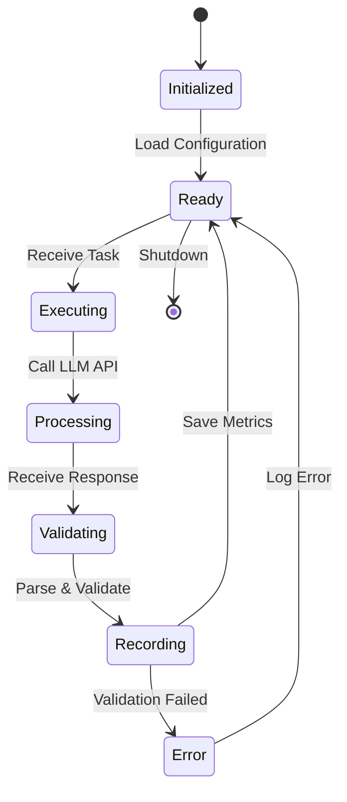
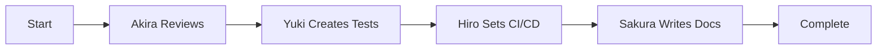
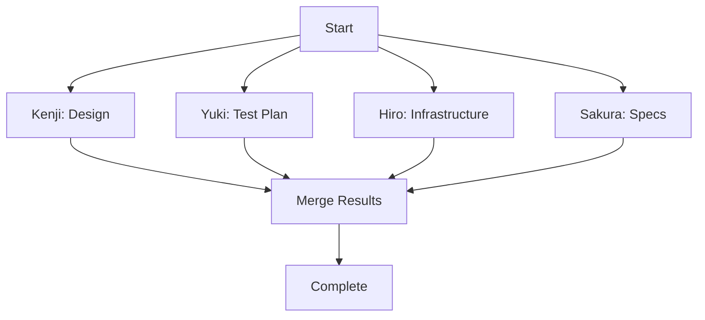
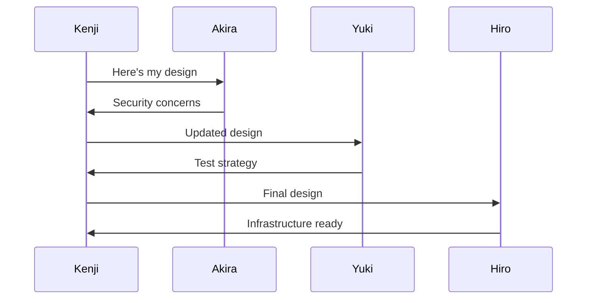

# 🤖 AI Agent System Overview

Tokyo-IA features **five specialized AI agents**, each with unique personalities, expertise areas, and powered by state-of-the-art LLM models. Together, they form a comprehensive AI-powered development team.

## 📋 Table of Contents

- [The Five Agents](#the-five-agents)
- [Agent Architecture](#agent-architecture)
- [How Agents Work](#how-agents-work)
- [Multi-Agent Workflows](#multi-agent-workflows)
- [Agent Capabilities](#agent-capabilities)
- [Model Selection](#model-selection)
- [Cost and Performance](#cost-and-performance)

---

## The Five Agents

### 侍 Akira (akira-001) - Code Review Master

<div align="center">
<h1>侍</h1>
</div>

**Model**: Claude Opus 4.1 (Anthropic)  
**Role**: Code Review & Security Analysis  
**Token Limit**: 200,000 tokens

**Personality**: 
Akira embodies the precision and discipline of a samurai. He approaches code review with meticulous attention to detail, never missing a potential security vulnerability or architectural flaw.

**Specialties**:
- 🔒 **Security Vulnerability Detection**
  - SQL injection, XSS, CSRF prevention
  - Authentication and authorization flaws
  - Cryptographic issues
  - Input validation problems

- ⚡ **Performance Optimization**
  - Algorithmic complexity analysis
  - Database query optimization
  - Memory leak detection
  - Concurrency issues

- 🏗️ **Architecture Review**
  - Design pattern analysis
  - SOLID principles enforcement
  - Code structure and organization
  - Dependency management

- ✨ **Best Practices**
  - Language-specific idioms
  - Error handling patterns
  - Code style consistency
  - Documentation completeness

**When to Use Akira**:
- Before merging pull requests
- Security audits
- Performance reviews
- Architecture assessments
- Code quality checks

**Example Task**:
```python
result = akira.execute({
    "type": "code_review",
    "language": "python",
    "code": "def login(user, pwd): ...",
    "focus": ["security", "performance"]
})
```

---

### ❄️ Yuki (yuki-002) - Test Engineering Specialist

<div align="center">
<h1>❄️</h1>
</div>

**Model**: OpenAI o3  
**Role**: Automated Testing & Quality Assurance  
**Token Limit**: 128,000 tokens

**Personality**:
Like fresh snow covering a landscape, Yuki ensures complete test coverage. Methodical and thorough, she designs comprehensive test suites that catch edge cases and corner scenarios.

**Specialties**:
- 🧪 **Unit Test Generation**
  - Test-driven development (TDD)
  - Code coverage optimization
  - Mock and stub creation
  - Assertion design

- 🔗 **Integration Testing**
  - API endpoint testing
  - Database integration tests
  - Service integration tests
  - Contract testing

- 🎭 **End-to-End Testing**
  - User flow testing
  - Selenium/Playwright tests
  - Mobile app testing
  - Cross-browser testing

- 📊 **Test Coverage Analysis**
  - Coverage gap identification
  - Critical path testing
  - Mutation testing
  - Performance testing

**When to Use Yuki**:
- Generating tests for new features
- Improving test coverage
- Designing test strategies
- Creating E2E test scenarios
- Performance test design

**Example Task**:
```python
result = yuki.execute({
    "type": "generate_tests",
    "language": "python",
    "code": "class UserService: ...",
    "test_types": ["unit", "integration"]
})
```

---

### 🛡️ Hiro (hiro-003) - SRE & DevOps Guardian

<div align="center">
<h1>🛡️</h1>
</div>

**Model**: Llama 4 405B (via Groq)  
**Role**: Site Reliability Engineering & DevOps  
**Token Limit**: 128,000 tokens

**Personality**:
Hiro is the steadfast guardian of system reliability. With deep infrastructure knowledge, he ensures applications run smoothly, scale efficiently, and recover gracefully from failures.

**Specialties**:
- ☸️ **Kubernetes & Container Orchestration**
  - Deployment manifests
  - Service configuration
  - Ingress and networking
  - Secrets management

- 🔄 **CI/CD Pipeline Design**
  - GitHub Actions workflows
  - GitLab CI pipelines
  - Jenkins pipelines
  - Deployment strategies

- 📊 **Monitoring & Alerting**
  - Prometheus metrics
  - Grafana dashboards
  - Alert rule configuration
  - Log aggregation

- 🎯 **Performance Tuning**
  - Resource optimization
  - Auto-scaling configuration
  - Load balancing
  - Database optimization

**When to Use Hiro**:
- Setting up CI/CD pipelines
- Kubernetes deployment
- Infrastructure as Code
- Monitoring setup
- Performance optimization
- Disaster recovery planning

**Example Task**:
```python
result = hiro.execute({
    "type": "create_k8s_deployment",
    "app_name": "my-api",
    "image": "my-api:latest",
    "port": 8080,
    "replicas": 3
})
```

---

### 🌸 Sakura (sakura-004) - Documentation Artist

<div align="center">
<h1>🌸</h1>
</div>

**Model**: Gemini 3.0 Ultra (Google)  
**Role**: Technical Documentation & Technical Writing  
**Token Limit**: 1,000,000 tokens (2M in some regions)

**Personality**:
Like cherry blossoms that bring beauty to the landscape, Sakura transforms complex technical concepts into clear, beautiful documentation. She believes documentation should be delightful to read.

**Specialties**:
- 📝 **Technical Writing**
  - User guides and tutorials
  - API documentation
  - Architecture documentation
  - Onboarding guides

- 📊 **Diagram Creation**
  - Architecture diagrams (Mermaid)
  - Sequence diagrams
  - Entity-relationship diagrams
  - Flow charts

- 🎨 **Content Organization**
  - Information architecture
  - Navigation design
  - Style guide creation
  - Documentation templates

- 🌐 **Multi-Format Documentation**
  - Markdown documentation
  - OpenAPI specifications
  - README files
  - Changelog generation

**When to Use Sakura**:
- Creating API documentation
- Writing user guides
- Generating README files
- Architecture documentation
- Tutorial creation
- Release notes

**Example Task**:
```python
result = sakura.execute({
    "type": "generate_api_docs",
    "endpoints": [...],
    "format": "markdown",
    "include_examples": True
})
```

---

### 🏗️ Kenji (kenji-005) - Architecture Visionary

<div align="center">
<h1>🏗️</h1>
</div>

**Model**: OpenAI o3  
**Role**: System Architecture & Design  
**Token Limit**: 128,000 tokens

**Personality**:
Kenji is the master architect who sees the big picture. He designs systems that are scalable, maintainable, and elegant, always considering future growth and technical debt.

**Specialties**:
- 🏛️ **System Design**
  - Microservices architecture
  - Monolith design
  - Service boundaries
  - API design

- 📐 **Design Patterns**
  - Gang of Four patterns
  - Enterprise patterns
  - Cloud design patterns
  - Anti-pattern identification

- 📈 **Scalability Planning**
  - Load estimation
  - Capacity planning
  - Bottleneck analysis
  - Growth strategy

- 🎯 **Technology Selection**
  - Database choice
  - Framework selection
  - Infrastructure decisions
  - Tool evaluation

**When to Use Kenji**:
- Designing new systems
- Architecture reviews
- Technology selection
- Scalability planning
- Refactoring large systems
- Migration planning

**Example Task**:
```python
result = kenji.execute({
    "type": "design_system",
    "requirements": {
        "users": "1M",
        "requests_per_second": "10K",
        "data_size": "100GB"
    }
})
```

---

## Agent Architecture

### Agent Base Class

All agents inherit from a common base class:

```python
class BaseAgent:
    """Base class for all Tokyo-IA agents"""
    
    def __init__(self, agent_id, name, role, model):
        self.agent_id = agent_id
        self.name = name
        self.role = role
        self.model = model
        self.client = self._init_llm_client()
        
    def execute(self, task):
        """Execute a task and return results"""
        # 1. Validate task
        # 2. Build prompt
        # 3. Call LLM API
        # 4. Parse response
        # 5. Record metrics
        # 6. Return result
        
    def _build_prompt(self, task):
        """Build LLM prompt from task"""
        
    def _parse_response(self, response):
        """Parse and structure LLM response"""
        
    def _record_metrics(self, task, result):
        """Record performance metrics to database"""
```

### Agent Lifecycle



---

## How Agents Work

### Task Execution Flow

1. **Task Reception**
   - Receive task from orchestrator
   - Validate task structure
   - Check prerequisites

2. **Prompt Engineering**
   - Load system prompt template
   - Inject task-specific context
   - Add examples if needed
   - Format for specific LLM

3. **LLM API Call**
   - Rate limiting check
   - API request with retry logic
   - Token counting
   - Streaming or batch

4. **Response Processing**
   - Parse structured output
   - Validate against schema
   - Extract key information
   - Handle errors

5. **Metrics Recording**
   - Tokens used
   - Latency measurement
   - Cost calculation
   - Success/failure status

6. **Result Return**
   - Structure result object
   - Include metadata
   - Return to orchestrator

### Example: Code Review Task

```python
# 1. Task Reception
task = {
    "type": "code_review",
    "language": "python",
    "code": "def unsafe_query(user_input): ...",
    "focus": ["security"]
}

# 2. Prompt Engineering
prompt = f"""
You are Akira, a code review expert. Review this Python code for security issues:

```python
{task['code']}
```

Focus on: {', '.join(task['focus'])}

Return a structured JSON response with:
- severity: critical|high|medium|low
- issues: list of found issues
- recommendations: list of fixes
"""

# 3. LLM API Call
response = anthropic.messages.create(
    model="claude-opus-4",
    max_tokens=4000,
    messages=[{"role": "user", "content": prompt}]
)

# 4. Response Processing
result = json.loads(response.content[0].text)

# 5. Metrics Recording
metrics = {
    "agent_id": "akira-001",
    "tokens_used": response.usage.total_tokens,
    "latency_ms": 2300,
    "cost_usd": 0.05
}

# 6. Result Return
return {
    "status": "completed",
    "result": result,
    "metrics": metrics
}
```

---

## Multi-Agent Workflows

### Sequential Workflow

Agents work one after another:



**Example**: Full code review pipeline

### Parallel Workflow

Agents work simultaneously:



**Example**: New feature planning

### Collaborative Workflow

Agents work together iteratively:



**Example**: Architecture refinement

---

## Agent Capabilities

### Supported Languages

All agents support these programming languages:

- Python
- JavaScript/TypeScript
- Go
- Java/Kotlin
- C#
- Ruby
- PHP
- Rust
- Swift
- And more...

### Task Types by Agent

| Agent | Task Types |
|-------|------------|
| **Akira** | code_review, security_audit, performance_review, architecture_review |
| **Yuki** | generate_tests, review_tests, test_strategy, coverage_analysis |
| **Hiro** | create_deployment, setup_cicd, configure_monitoring, optimize_performance |
| **Sakura** | write_docs, create_diagrams, generate_readme, api_documentation |
| **Kenji** | design_system, architecture_review, technology_selection, refactoring_plan |

---

## Model Selection

### Why These Models?

| Agent | Model | Reason |
|-------|-------|--------|
| Akira | Claude Opus 4.1 | Best for detailed analysis, security, and code understanding |
| Yuki | OpenAI o3 | Excellent reasoning for test case generation |
| Hiro | Llama 4 405B | Cost-effective for infrastructure tasks, fast responses |
| Sakura | Gemini Ultra | Massive context window (2M), great for documentation |
| Kenji | OpenAI o3 | Superior reasoning for architecture decisions |

### Model Alternatives

You can configure alternative models in the agent settings:

```python
# Example: Use Claude for all agents
orchestrator.configure_agent("yuki-002", model="claude-opus-4")
orchestrator.configure_agent("hiro-003", model="claude-sonnet-3.5")
```

---

## Cost and Performance

### Token Usage

Average tokens per task type:

| Task Type | Avg Tokens | Cost (Approx) |
|-----------|------------|---------------|
| Code Review | 2,000-5,000 | $0.05-$0.15 |
| Test Generation | 3,000-8,000 | $0.08-$0.20 |
| Documentation | 1,000-10,000 | $0.03-$0.30 |
| Architecture Design | 4,000-12,000 | $0.10-$0.35 |
| CI/CD Setup | 2,000-6,000 | $0.02-$0.08 |

### Performance Metrics

| Metric | Target | Current |
|--------|--------|---------|
| Average Latency | < 3s | 2.3s |
| Success Rate | > 95% | 97.8% |
| Token Efficiency | - | 4.2K avg |
| Cost per Task | < $0.20 | $0.12 avg |

---

## Next Steps

- **[Orchestrator Guide](orchestrator.md)** - Learn about multi-agent coordination
- **[Workflows](workflows.md)** - Pre-built and custom workflows
- **[Individual Agents](individual-agents.md)** - Detailed agent documentation
- **[Integration Guide](integration-guide.md)** - Integrate agents in your app

---

*Last updated: 2025-12-23*
