# 🏗️ System Architecture Overview

Welcome to the Tokyo-IA architecture documentation! This guide provides a comprehensive overview of how Tokyo-IA is designed and built.

## 📋 Table of Contents

- [High-Level Architecture](#high-level-architecture)
- [System Components](#system-components)
- [Technology Stack](#technology-stack)
- [Design Principles](#design-principles)
- [Scalability Considerations](#scalability-considerations)
- [Architecture Diagrams](#architecture-diagrams)

---

## High-Level Architecture

Tokyo-IA is built as a **multi-tier, polyglot microservices architecture** that combines the performance of Go with the flexibility of Python for AI workloads.

```mermaid
graph TB
    subgraph "Client Layer"
        WEB[Web Dashboard<br/>React + TypeScript]
        MOBILE[Android App<br/>Kotlin]
        CLI[CLI Tools<br/>Go]
        API_CLIENT[API Clients<br/>cURL, SDKs]
    end
    
    subgraph "API Gateway Layer"
        GATEWAY[Registry API Server<br/>Go + net/http<br/>Port 8080]
    end
    
    subgraph "Orchestration Layer"
        ORCH[Agent Orchestrator<br/>Python + CrewAI]
    end
    
    subgraph "Agent Layer"
        AKIRA[侍 Akira<br/>Claude Opus 4.1<br/>Code Review]
        YUKI[❄️ Yuki<br/>OpenAI o3<br/>Testing]
        HIRO[🛡️ Hiro<br/>Llama 4 405B<br/>DevOps]
        SAKURA[🌸 Sakura<br/>Gemini 3.0 Ultra<br/>Documentation]
        KENJI[🏗️ Kenji<br/>OpenAI o3<br/>Architecture]
    end
    
    subgraph "Data Layer"
        DB[(PostgreSQL 14+<br/>Agent Registry<br/>Tasks & Metrics)]
        CACHE[(Redis Cache<br/>Optional)]
    end
    
    subgraph "External Services"
        ANTHROPIC[Anthropic API]
        OPENAI[OpenAI API]
        GROQ[Groq API]
        GOOGLE[Google AI API]
    end
    
    WEB --> GATEWAY
    MOBILE --> GATEWAY
    CLI --> GATEWAY
    API_CLIENT --> GATEWAY
    
    GATEWAY --> DB
    GATEWAY --> ORCH
    GATEWAY --> CACHE
    
    ORCH --> AKIRA
    ORCH --> YUKI
    ORCH --> HIRO
    ORCH --> SAKURA
    ORCH --> KENJI
    
    AKIRA --> ANTHROPIC
    YUKI --> OPENAI
    HIRO --> GROQ
    SAKURA --> GOOGLE
    KENJI --> OPENAI
    
    AKIRA --> DB
    YUKI --> DB
    HIRO --> DB
    SAKURA --> DB
    KENJI --> DB
    
    style AKIRA fill:#ff6b6b
    style YUKI fill:#4ecdc4
    style HIRO fill:#95e1d3
    style SAKURA fill:#ffa8a8
    style KENJI fill:#a8e6cf
```

---

## System Components

### 1. Client Layer

**Purpose**: User interfaces and API clients

- **Web Dashboard** (TypeScript + React)
  - Real-time agent monitoring
  - Workflow visualization
  - Task management
  - Analytics and metrics

- **Android App** (Kotlin)
  - Mobile agent access
  - On-the-go workflow execution
  - Push notifications
  - Offline capability

- **CLI Tools** (Go)
  - Command-line interface
  - Scripting and automation
  - CI/CD integration
  - Batch operations

### 2. API Gateway Layer

**Purpose**: Request routing, authentication, and rate limiting

- **Registry API Server** (Go)
  - RESTful HTTP API
  - Request validation
  - Authentication & authorization
  - Rate limiting
  - Request logging
  - Error handling
  - Health checks

**Key Features**:
- Built with Go's `net/http` for performance
- PostgreSQL connection pooling
- Structured JSON logging
- Graceful shutdown
- CORS support

### 3. Orchestration Layer

**Purpose**: Multi-agent workflow coordination

- **Agent Orchestrator** (Python + CrewAI)
  - Agent registration and discovery
  - Task distribution and routing
  - Workflow execution engine
  - Inter-agent communication
  - State management
  - Error recovery
  - Metric collection

**Responsibilities**:
- Load balancing across agents
- Task queuing and prioritization
- Workflow state persistence
- Agent health monitoring
- Token usage tracking
- Cost optimization

### 4. Agent Layer

**Purpose**: Specialized AI capabilities

Five specialized agents, each with unique expertise:

| Agent | Model | Specialty | Token Limit |
|-------|-------|-----------|-------------|
| 侍 **Akira** | Claude Opus 4.1 | Code Review, Security | 200K |
| ❄️ **Yuki** | OpenAI o3 | Test Engineering | 128K |
| 🛡️ **Hiro** | Llama 4 405B | SRE, DevOps, Infrastructure | 128K |
| 🌸 **Sakura** | Gemini 3.0 Ultra | Documentation, Technical Writing | 1M |
| 🏗️ **Kenji** | OpenAI o3 | System Architecture, Design | 128K |

**Agent Capabilities**:
- Prompt engineering and templating
- Context management
- Response parsing and validation
- Retry logic with exponential backoff
- Token counting and cost tracking
- Streaming responses (where supported)

### 5. Data Layer

**Purpose**: Persistent storage and caching

- **PostgreSQL Database**
  - Agent registry
  - Task execution records
  - Workflow history
  - Performance metrics
  - User sessions
  - Inter-agent communications

- **Redis Cache** (Optional)
  - Response caching
  - Rate limiting counters
  - Session storage
  - Real-time metrics

---

## Technology Stack

### Backend Core

- **Go 1.21+**
  - High-performance API server
  - Concurrent request handling
  - Efficient memory usage
  - Fast compilation
  - Built-in testing

### AI & ML

- **Python 3.11+**
  - CrewAI framework for agent orchestration
  - LLM provider SDKs (Anthropic, OpenAI, Google)
  - Rich ecosystem for AI/ML
  - Easy prototyping

### Database

- **PostgreSQL 14+**
  - ACID compliance
  - JSON/JSONB support
  - Full-text search
  - Time-series capabilities
  - Excellent performance

### Frontend

- **TypeScript + React**
  - Type safety
  - Component reusability
  - Rich ecosystem
  - Modern development experience

### Mobile

- **Kotlin + Jetpack Compose**
  - Native Android performance
  - Modern UI toolkit
  - Coroutines for async
  - Type safety

### Infrastructure

- **Docker & Docker Compose**
  - Containerization
  - Development environment
  - Easy deployment

- **Railway** (Recommended Platform)
  - One-click deployment
  - Auto-scaling
  - Built-in PostgreSQL
  - GitHub integration

- **Kubernetes** (For Scale)
  - Container orchestration
  - Auto-scaling
  - Self-healing
  - Load balancing

---

## Design Principles

### 1. Separation of Concerns

Each layer has a specific responsibility:
- **API Layer**: HTTP handling, validation, routing
- **Orchestration Layer**: Workflow coordination
- **Agent Layer**: AI-specific tasks
- **Data Layer**: Persistence

### 2. Polyglot Architecture

Use the right language for the job:
- **Go**: High-performance, concurrent API server
- **Python**: AI/ML flexibility and ecosystem
- **TypeScript**: Type-safe frontend
- **Kotlin**: Native mobile performance

### 3. Stateless Services

- API servers are stateless (except database)
- Easy horizontal scaling
- No sticky sessions required
- Simplified deployment

### 4. Database-Centric State

- All state persisted in PostgreSQL
- Enables easy recovery
- Audit trail for compliance
- Historical analysis

### 5. Async Communication

- Task queue for agent jobs
- Non-blocking API responses
- Webhook notifications
- Event-driven updates

### 6. Fail-Fast Philosophy

- Early validation
- Clear error messages
- Graceful degradation
- Automatic retries where appropriate

### 7. Observability First

- Structured logging (JSON)
- Prometheus metrics
- Distributed tracing
- Health checks

---

## Scalability Considerations

### Horizontal Scaling

**API Servers**:
- Stateless design allows unlimited horizontal scaling
- Load balancer distributes requests
- Each instance handles 1000+ concurrent connections

**Agent Workers**:
- Scale Python agent workers independently
- Each worker handles multiple agents
- Queue-based load distribution

### Vertical Scaling

**Database**:
- PostgreSQL handles vertical scaling well
- Connection pooling optimizes resource usage
- Read replicas for read-heavy workloads

### Caching Strategy

**Multi-Level Caching**:
1. **Application Level**: In-memory LRU cache
2. **Redis Layer**: Distributed cache
3. **Database Level**: Query result cache

### Database Optimization

**Indexing Strategy**:
- Primary keys on all tables
- Foreign key indexes
- Composite indexes for common queries
- Partial indexes for filtered queries

**Partitioning**:
- Time-based partitioning for metrics
- Agent-based partitioning for tasks
- Archive old data to cold storage

### Performance Targets

| Metric | Target | Production |
|--------|--------|------------|
| API Response Time (p95) | < 100ms | 45ms |
| Agent Task Latency (p95) | < 5s | 2.8s |
| Concurrent API Requests | 10,000+ | 15,000 |
| Database Connections | 100+ | 150 |
| Tasks per Second | 100+ | 250 |

---

## Architecture Diagrams

### Request Flow Diagram

### Data Flow Diagram

### Deployment Architecture

---

## Next Steps

- **[System Design](system-design.md)** - Deep dive into component design
- **[Data Flow](data-flow.md)** - Detailed request lifecycle
- **[Technology Stack](technology-stack.md)** - Technology decisions and alternatives
- **[Components](components.md)** - Individual component documentation

---

*Last updated: 2025-12-23*
