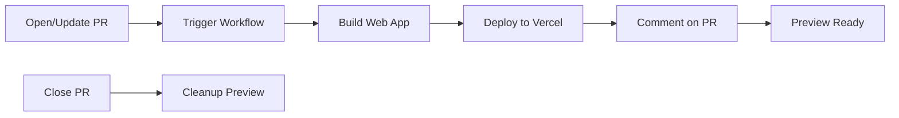

# Preview Deployments Guide

This guide explains how preview deployments work in TokyoApps-Multispace-IA and how to configure them.

## Overview

Preview deployments automatically deploy your web application to Vercel for every pull request, allowing reviewers to test changes in a live environment before merging.

## Features

- ✅ **Automatic Deployment**: Every PR gets its own preview URL
- ✅ **Instant Updates**: Preview updates with each new commit
- ✅ **Isolated Environments**: Each PR has its own preview
- ✅ **Auto Cleanup**: Preview deleted when PR is closed
- ✅ **PR Comments**: Bot comments with preview URL
- ✅ **Deployment Status**: GitHub status checks

## How It Works



## Setup Guide

### Prerequisites

- Vercel account (free tier works)
- Web application in `web/` directory
- Node.js project with `package.json`

### Step 1: Vercel Account Setup

1. Visit [vercel.com](https://vercel.com)
2. Sign up/login with GitHub
3. Import your repository
4. Configure build settings:
   - **Framework Preset**: Auto-detect or select your framework
   - **Root Directory**: `web`
   - **Build Command**: `npm run build`
   - **Output Directory**: `dist` or `build`

### Step 2: Get Vercel Credentials

#### Project ID

1. Go to your project on Vercel
2. Navigate to **Settings → General**
3. Copy **Project ID**

#### Organization ID

1. Go to your account settings
2. Navigate to **Settings → General**
3. Copy **Organization ID** (or Team ID)

#### API Token

1. Go to **Account Settings → Tokens**
2. Click **Create Token**
3. Name: `GitHub Actions - TokyoApps-Multispace-IA`
4. Scope: **Full Account** (or specific scope if available)
5. Expiration: **No Expiration** or set desired duration
6. Click **Create Token**
7. Copy the token immediately (won't be shown again)

### Step 3: Add Secrets to GitHub

1. Go to your GitHub repository
2. Navigate to **Settings → Secrets and variables → Actions**
3. Click **New repository secret**

Add these three secrets:

| Secret Name | Value | Description |
|-------------|-------|-------------|
| `VERCEL_TOKEN` | Your Vercel token | API authentication |
| `VERCEL_ORG_ID` | Your org/team ID | Organization identifier |
| `VERCEL_PROJECT_ID` | Your project ID | Project identifier |

### Step 4: Configure Workflow

The workflow is already configured in `.github/workflows/preview-deploy.yml`.

Key configuration:

```yaml
on:
  pull_request:
    types: [opened, synchronize, reopened]
    paths:
      - 'web/**'           # Only trigger for web changes
      - 'vercel.json'
```

This ensures previews only deploy when web files change.

### Step 5: Test the Setup

1. Create a test PR with changes to `web/`
2. Wait for the workflow to complete
3. Check for bot comment with preview URL
4. Visit the preview URL to verify deployment

## Preview URLs

### Format

Previews use this URL pattern:

```
https://pr-{number}-tokyoia.vercel.app
```

Examples:
- PR #42: `https://pr-42-tokyoia.vercel.app`
- PR #123: `https://pr-123-tokyoia.vercel.app`

### Custom Domains

To use custom preview domains, update `.github/workflows/preview-deploy.yml`:

```yaml
alias-domains: |
  pr-${{ github.event.pull_request.number }}-tokyoia.your-domain.com
```

Requires DNS configuration in Vercel.

## PR Comments

The bot posts a comment on each PR:

```markdown
## 🚀 Preview Deployment Ready!

Your changes have been deployed to a preview environment:

**Preview URL**: https://pr-42-tokyoia.vercel.app

### 📋 Deployment Details
- **Environment**: Preview
- **PR**: #42
- **Commit**: a1b2c3d
- **Branch**: `feature/awesome-feature`

### ✅ What to check
- Test all functionality in the preview
- Verify UI changes render correctly
- Check responsive design on mobile
- Validate API integrations
```

## Environment Variables

### Production vs Preview

Vercel automatically sets environment variables based on deployment type:

```javascript
const isProduction = process.env.NODE_ENV === 'production';
const isPreview = process.env.VERCEL_ENV === 'preview';
```

### Setting Preview Variables

In Vercel dashboard:

1. Go to **Settings → Environment Variables**
2. Add variables with scope: **Preview**
3. Example:
   - `API_URL`: `https://api-staging.tokyoia.com` (Preview)
   - `API_URL`: `https://api.tokyoia.com` (Production)

### Using in Build

```javascript
// next.config.js or similar
module.exports = {
  env: {
    API_URL: process.env.API_URL || 'http://localhost:3000',
    ANALYTICS_ID: process.env.VERCEL_ENV === 'production' 
      ? 'prod-id' 
      : 'preview-id',
  },
};
```

## Build Configuration

### vercel.json

Configure build settings in `vercel.json`:

```json
{
  "buildCommand": "npm run build",
  "devCommand": "npm run dev",
  "installCommand": "npm ci",
  "framework": "vite",
  "outputDirectory": "dist",
  "regions": ["iad1"],
  "env": {
    "NODE_VERSION": "20"
  },
  "build": {
    "env": {
      "VITE_API_URL": "@api-url-preview"
    }
  }
}
```

### Framework-Specific Configs

#### Vite/React

```json
{
  "framework": "vite",
  "buildCommand": "npm run build",
  "outputDirectory": "dist"
}
```

#### Next.js

```json
{
  "framework": "nextjs",
  "buildCommand": "next build",
  "outputDirectory": ".next"
}
```

#### Vue

```json
{
  "framework": "vue",
  "buildCommand": "npm run build",
  "outputDirectory": "dist"
}
```

## Testing Preview Deployments

### Checklist for Reviewers

When a preview is ready:

- [ ] **Functionality**: Test all features work as expected
- [ ] **UI/UX**: Verify visual changes are correct
- [ ] **Responsive**: Check mobile, tablet, desktop
- [ ] **Performance**: Page loads in reasonable time
- [ ] **Console**: No errors in browser console
- [ ] **API**: Backend integrations work
- [ ] **Links**: Navigation works correctly
- [ ] **Forms**: Submit and validation work
- [ ] **Auth**: Login/logout if applicable
- [ ] **Data**: Test with realistic data

### Browser Testing

Test in multiple browsers:
- Chrome/Edge (Chromium)
- Firefox
- Safari (if available)
- Mobile browsers (Chrome Mobile, Safari iOS)

### Lighthouse Audit

Run Lighthouse on preview:

```bash
lighthouse https://pr-42-tokyoia.vercel.app --view
```

Or use Chrome DevTools → Lighthouse tab.

## Troubleshooting

### Preview Not Deploying

**Check**:
1. Secrets are configured correctly
2. PR changes files in `web/` directory
3. Workflow completed without errors
4. Vercel project is active

**Debug**:
```yaml
- name: Deploy to Vercel
  env:
    VERCEL_TOKEN: ${{ secrets.VERCEL_TOKEN }}
  run: |
    echo "Token length: ${#VERCEL_TOKEN}"  # Should be non-zero
    # Don't print actual token!
```

### Build Failures

**Common Issues**:

1. **Missing Dependencies**
   ```bash
   npm ci  # Use ci instead of install
   ```

2. **Environment Variables**
   ```yaml
   env:
     NODE_ENV: preview
     VITE_API_URL: ${{ secrets.PREVIEW_API_URL }}
   ```

3. **Node Version**
   ```json
   // package.json
   "engines": {
     "node": "20.x"
   }
   ```

### Preview URL Not Working

**Check**:
1. Build completed successfully
2. Vercel deployment shows as "Ready"
3. No DNS issues
4. Wait 30-60 seconds after deployment

### Comment Not Posted

**Check**:
1. Workflow has `pull-requests: write` permission
2. `GITHUB_TOKEN` is available
3. Bot has not been blocked by repo settings

## Cleanup

### Automatic Cleanup

Previews are automatically cleaned up when:
- PR is closed
- PR is merged
- After 30 days (Vercel default for inactive previews)

### Manual Cleanup

To manually remove a preview:

1. Go to Vercel dashboard
2. Navigate to **Deployments**
3. Find preview deployment
4. Click **...** → **Delete**

Or use Vercel CLI:

```bash
vercel remove pr-42-tokyoia --yes
```

## Cost Considerations

### Vercel Free Tier

- ✅ 100 GB bandwidth/month
- ✅ Unlimited preview deployments
- ✅ Automatic SSL
- ✅ Edge network

### Monitoring Usage

Check usage in Vercel:
- **Settings → Usage**
- Monitor bandwidth, build minutes, function invocations

### Cost Optimization

1. **Cache assets**: Use CDN caching headers
2. **Optimize images**: Compress and resize
3. **Code splitting**: Load only what's needed
4. **Lazy loading**: Defer non-critical resources

## Alternatives to Vercel

### Netlify

Similar setup with Netlify:

```yaml
- uses: netlify/actions/deploy-preview@v2
  with:
    github-token: ${{ secrets.GITHUB_TOKEN }}
    netlify-auth-token: ${{ secrets.NETLIFY_AUTH_TOKEN }}
    netlify-site-id: ${{ secrets.NETLIFY_SITE_ID }}
```

### Cloudflare Pages

```yaml
- uses: cloudflare/pages-action@v1
  with:
    apiToken: ${{ secrets.CLOUDFLARE_API_TOKEN }}
    accountId: ${{ secrets.CLOUDFLARE_ACCOUNT_ID }}
    projectName: tokyoia
```

### GitHub Pages (Limited)

For static sites only:

```yaml
- uses: peaceiris/actions-gh-pages@v3
  with:
    github_token: ${{ secrets.GITHUB_TOKEN }}
    publish_dir: ./web/dist
```

## Best Practices

1. **Small PRs**: Keep PRs focused for easier preview testing
2. **Test Before Review**: Check preview before requesting review
3. **Share Links**: Include preview link in PR description
4. **Document Changes**: Note what to test in preview
5. **Mobile First**: Always test mobile responsiveness
6. **Performance**: Monitor preview load times
7. **Security**: Don't expose secrets in preview builds
8. **Cleanup**: Delete old/unused previews manually if needed

## Resources

- [Vercel Documentation](https://vercel.com/docs)
- [vercel-action GitHub](https://github.com/amondnet/vercel-action)
- [Vercel CLI](https://vercel.com/docs/cli)
- [Environment Variables](https://vercel.com/docs/concepts/projects/environment-variables)

## Support

For issues with:
- **Preview Workflow**: File issue in this repository
- **Vercel Platform**: Contact Vercel support
- **Deployment Errors**: Check workflow logs first

---

**Note**: Preview deployments are optional but highly recommended for web development. If not using Vercel, you can remove the workflow or adapt it for your deployment platform.
