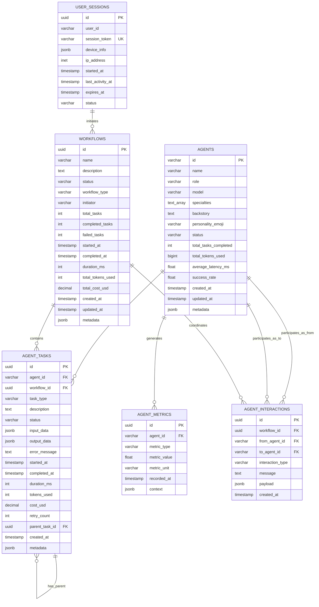

# 🗄️ Database Schema Documentation

Complete documentation of the Tokyo-IA PostgreSQL database schema, including tables, relationships, indexes, and best practices.

## 📋 Table of Contents

- [Overview](#overview)
- [Entity-Relationship Diagram](#entity-relationship-diagram)
- [Tables](#tables)
- [Indexes](#indexes)
- [Constraints](#constraints)
- [Functions and Triggers](#functions-and-triggers)
- [Query Patterns](#query-patterns)

---

## Overview

Tokyo-IA uses **PostgreSQL 14+** as its primary database. The schema is designed for:

- **Scalability**: Efficient indexing and partitioning strategies
- **Integrity**: Foreign keys and constraints
- **Performance**: Optimized for common query patterns
- **Auditability**: Timestamps on all records
- **Flexibility**: JSONB for metadata and extensibility

**Database Size Estimates:**
- Small deployment (1K tasks/day): ~5GB/year
- Medium deployment (10K tasks/day): ~50GB/year
- Large deployment (100K tasks/day): ~500GB/year

---

## Entity-Relationship Diagram



---

## Tables

### agents

Stores the five specialized AI agents.

```sql
CREATE TABLE agents (
    id VARCHAR(50) PRIMARY KEY,
    name VARCHAR(100) NOT NULL,
    role VARCHAR(200) NOT NULL,
    model VARCHAR(100) NOT NULL,
    specialties TEXT[] NOT NULL,
    backstory TEXT,
    personality_emoji VARCHAR(10),
    status VARCHAR(20) DEFAULT 'active' CHECK (status IN ('active', 'inactive', 'maintenance')),
    total_tasks_completed INTEGER DEFAULT 0,
    total_tokens_used BIGINT DEFAULT 0,
    average_latency_ms FLOAT DEFAULT 0,
    success_rate FLOAT DEFAULT 100.0,
    created_at TIMESTAMP WITH TIME ZONE DEFAULT CURRENT_TIMESTAMP,
    updated_at TIMESTAMP WITH TIME ZONE DEFAULT CURRENT_TIMESTAMP,
    metadata JSONB DEFAULT '{}'::jsonb
);
```

**Columns:**

| Column | Type | Description |
|--------|------|-------------|
| `id` | VARCHAR(50) | Unique agent identifier (e.g., "akira-001") |
| `name` | VARCHAR(100) | Display name |
| `role` | VARCHAR(200) | Primary function/specialty |
| `model` | VARCHAR(100) | LLM model identifier |
| `specialties` | TEXT[] | Array of expertise areas |
| `backstory` | TEXT | Agent personality and background |
| `personality_emoji` | VARCHAR(10) | Emoji representation (e.g., "侍") |
| `status` | VARCHAR(20) | Agent status: active, inactive, maintenance |
| `total_tasks_completed` | INTEGER | Cumulative task count |
| `total_tokens_used` | BIGINT | Total tokens consumed |
| `average_latency_ms` | FLOAT | Average response time |
| `success_rate` | FLOAT | Success percentage (0-100) |
| `created_at` | TIMESTAMP | Creation timestamp |
| `updated_at` | TIMESTAMP | Last update timestamp |
| `metadata` | JSONB | Additional configuration |

**Example Data:**

```sql
INSERT INTO agents (id, name, role, model, specialties, personality_emoji) VALUES
  ('akira-001', 'Akira - Code Review Master', 'code_review', 'claude-opus-4.1', 
   ARRAY['security', 'performance', 'architecture'], '侍'),
  ('yuki-002', 'Yuki - Test Engineering Specialist', 'test_engineering', 'openai-o3',
   ARRAY['unit_testing', 'integration_testing', 'e2e_testing'], '❄️');
```

**Indexes:**
- Primary key on `id`
- Index on `status` for active agent queries

---

### workflows

Multi-agent workflow orchestration records.

```sql
CREATE TABLE workflows (
    id UUID PRIMARY KEY DEFAULT uuid_generate_v4(),
    name VARCHAR(200) NOT NULL,
    description TEXT,
    status VARCHAR(20) DEFAULT 'pending' CHECK (status IN ('pending', 'running', 'completed', 'failed', 'cancelled')),
    workflow_type VARCHAR(100),
    initiator VARCHAR(100),
    total_tasks INTEGER DEFAULT 0,
    completed_tasks INTEGER DEFAULT 0,
    failed_tasks INTEGER DEFAULT 0,
    started_at TIMESTAMP WITH TIME ZONE,
    completed_at TIMESTAMP WITH TIME ZONE,
    duration_ms INTEGER,
    total_tokens_used INTEGER DEFAULT 0,
    total_cost_usd DECIMAL(10, 6) DEFAULT 0,
    created_at TIMESTAMP WITH TIME ZONE DEFAULT CURRENT_TIMESTAMP,
    updated_at TIMESTAMP WITH TIME ZONE DEFAULT CURRENT_TIMESTAMP,
    metadata JSONB DEFAULT '{}'::jsonb
);
```

**Columns:**

| Column | Type | Description |
|--------|------|-------------|
| `id` | UUID | Unique workflow identifier |
| `name` | VARCHAR(200) | Workflow name |
| `description` | TEXT | Detailed description |
| `status` | VARCHAR(20) | pending, running, completed, failed, cancelled |
| `workflow_type` | VARCHAR(100) | Type of workflow (e.g., "code_review") |
| `initiator` | VARCHAR(100) | User or system that started workflow |
| `total_tasks` | INTEGER | Total number of tasks |
| `completed_tasks` | INTEGER | Successfully completed tasks |
| `failed_tasks` | INTEGER | Failed tasks |
| `started_at` | TIMESTAMP | Workflow start time |
| `completed_at` | TIMESTAMP | Workflow completion time |
| `duration_ms` | INTEGER | Total duration in milliseconds |
| `total_tokens_used` | INTEGER | Cumulative tokens across all tasks |
| `total_cost_usd` | DECIMAL(10,6) | Total cost in USD |
| `created_at` | TIMESTAMP | Creation timestamp |
| `updated_at` | TIMESTAMP | Last update timestamp |
| `metadata` | JSONB | Additional workflow data |

**Indexes:**
- Primary key on `id`
- Index on `status` for active workflow queries
- Index on `created_at` for time-based queries
- Index on `workflow_type` for filtering

---

### agent_tasks

Individual task execution records.

```sql
CREATE TABLE agent_tasks (
    id UUID PRIMARY KEY DEFAULT uuid_generate_v4(),
    agent_id VARCHAR(50) NOT NULL REFERENCES agents(id) ON DELETE CASCADE,
    workflow_id UUID REFERENCES workflows(id) ON DELETE CASCADE,
    task_type VARCHAR(100) NOT NULL,
    description TEXT NOT NULL,
    status VARCHAR(20) DEFAULT 'pending' CHECK (status IN ('pending', 'running', 'completed', 'failed', 'cancelled')),
    input_data JSONB,
    output_data JSONB,
    error_message TEXT,
    started_at TIMESTAMP WITH TIME ZONE,
    completed_at TIMESTAMP WITH TIME ZONE,
    duration_ms INTEGER,
    tokens_used INTEGER DEFAULT 0,
    cost_usd DECIMAL(10, 6) DEFAULT 0,
    retry_count INTEGER DEFAULT 0,
    parent_task_id UUID REFERENCES agent_tasks(id),
    created_at TIMESTAMP WITH TIME ZONE DEFAULT CURRENT_TIMESTAMP,
    metadata JSONB DEFAULT '{}'::jsonb
);
```

**Columns:**

| Column | Type | Description |
|--------|------|-------------|
| `id` | UUID | Unique task identifier |
| `agent_id` | VARCHAR(50) | Agent executing the task (FK) |
| `workflow_id` | UUID | Parent workflow (FK, nullable) |
| `task_type` | VARCHAR(100) | Type of task (e.g., "code_review") |
| `description` | TEXT | Task description |
| `status` | VARCHAR(20) | Task status |
| `input_data` | JSONB | Task input parameters |
| `output_data` | JSONB | Task results |
| `error_message` | TEXT | Error details if failed |
| `started_at` | TIMESTAMP | Execution start time |
| `completed_at` | TIMESTAMP | Execution end time |
| `duration_ms` | INTEGER | Execution duration |
| `tokens_used` | INTEGER | LLM tokens consumed |
| `cost_usd` | DECIMAL(10,6) | Task cost |
| `retry_count` | INTEGER | Number of retry attempts |
| `parent_task_id` | UUID | Parent task for subtasks (FK) |
| `created_at` | TIMESTAMP | Creation timestamp |
| `metadata` | JSONB | Additional task data |

**Indexes:**
- Primary key on `id`
- Foreign key index on `agent_id`
- Foreign key index on `workflow_id`
- Composite index on `(agent_id, status, created_at)` for agent task queries
- Index on `status` for filtering
- Index on `created_at` for time-based queries

---

### agent_metrics

Time-series performance metrics.

```sql
CREATE TABLE agent_metrics (
    id UUID PRIMARY KEY DEFAULT uuid_generate_v4(),
    agent_id VARCHAR(50) NOT NULL REFERENCES agents(id) ON DELETE CASCADE,
    metric_type VARCHAR(50) NOT NULL,
    metric_value FLOAT NOT NULL,
    metric_unit VARCHAR(20),
    recorded_at TIMESTAMP WITH TIME ZONE DEFAULT CURRENT_TIMESTAMP,
    context JSONB DEFAULT '{}'::jsonb
);
```

**Metric Types:**
- `latency` - Response time in milliseconds
- `tokens` - Token usage
- `cost` - Cost in USD
- `success_rate` - Success percentage
- `error_rate` - Error percentage

**Indexes:**
- Primary key on `id`
- Composite index on `(agent_id, metric_type, recorded_at)` for time-series queries
- Consider partitioning by `recorded_at` for large datasets

---

### agent_interactions

Communication between agents in workflows.

```sql
CREATE TABLE agent_interactions (
    id UUID PRIMARY KEY DEFAULT uuid_generate_v4(),
    workflow_id UUID REFERENCES workflows(id) ON DELETE CASCADE,
    from_agent_id VARCHAR(50) NOT NULL REFERENCES agents(id),
    to_agent_id VARCHAR(50) NOT NULL REFERENCES agents(id),
    interaction_type VARCHAR(50) NOT NULL,
    message TEXT,
    payload JSONB,
    created_at TIMESTAMP WITH TIME ZONE DEFAULT CURRENT_TIMESTAMP
);
```

**Interaction Types:**
- `handoff` - Task handoff between agents
- `collaboration` - Joint work
- `review` - One agent reviews another's work
- `feedback` - Providing feedback

**Indexes:**
- Primary key on `id`
- Index on `workflow_id`
- Composite index on `(from_agent_id, to_agent_id)`

---

### user_sessions

Track user sessions (for future authentication).

```sql
CREATE TABLE user_sessions (
    id UUID PRIMARY KEY DEFAULT uuid_generate_v4(),
    user_id VARCHAR(100) NOT NULL,
    session_token VARCHAR(255) UNIQUE NOT NULL,
    device_info JSONB,
    ip_address INET,
    started_at TIMESTAMP WITH TIME ZONE DEFAULT CURRENT_TIMESTAMP,
    last_activity_at TIMESTAMP WITH TIME ZONE DEFAULT CURRENT_TIMESTAMP,
    expires_at TIMESTAMP WITH TIME ZONE,
    status VARCHAR(20) DEFAULT 'active' CHECK (status IN ('active', 'expired', 'revoked'))
);
```

---

## Indexes

### Performance Indexes

```sql
-- Agent queries
CREATE INDEX idx_agents_status ON agents(status);

-- Workflow queries
CREATE INDEX idx_workflows_status ON workflows(status);
CREATE INDEX idx_workflows_created_at ON workflows(created_at DESC);
CREATE INDEX idx_workflows_type ON workflows(workflow_type);

-- Task queries
CREATE INDEX idx_tasks_agent_status ON agent_tasks(agent_id, status, created_at DESC);
CREATE INDEX idx_tasks_workflow ON agent_tasks(workflow_id);
CREATE INDEX idx_tasks_status ON agent_tasks(status);
CREATE INDEX idx_tasks_created_at ON agent_tasks(created_at DESC);

-- Metrics queries (time-series)
CREATE INDEX idx_metrics_agent_type_time ON agent_metrics(agent_id, metric_type, recorded_at DESC);

-- Interaction queries
CREATE INDEX idx_interactions_workflow ON agent_interactions(workflow_id);
CREATE INDEX idx_interactions_agents ON agent_interactions(from_agent_id, to_agent_id);
```

---

## Constraints

### Foreign Keys

All foreign keys use `ON DELETE CASCADE` or `ON DELETE SET NULL` for referential integrity.

### Check Constraints

Status enums are enforced with CHECK constraints:

```sql
CHECK (status IN ('pending', 'running', 'completed', 'failed', 'cancelled'))
```

### Unique Constraints

- `agents.id` - Agent ID must be unique
- `user_sessions.session_token` - Session tokens must be unique

---

## Functions and Triggers

### Update Timestamp Trigger

```sql
CREATE OR REPLACE FUNCTION update_updated_at_column()
RETURNS TRIGGER AS $$
BEGIN
    NEW.updated_at = CURRENT_TIMESTAMP;
    RETURN NEW;
END;
$$ LANGUAGE plpgsql;

CREATE TRIGGER update_agents_updated_at
    BEFORE UPDATE ON agents
    FOR EACH ROW
    EXECUTE FUNCTION update_updated_at_column();

CREATE TRIGGER update_workflows_updated_at
    BEFORE UPDATE ON workflows
    FOR EACH ROW
    EXECUTE FUNCTION update_updated_at_column();
```

### Calculate Workflow Duration

```sql
CREATE OR REPLACE FUNCTION calculate_workflow_duration()
RETURNS TRIGGER AS $$
BEGIN
    IF NEW.status = 'completed' AND NEW.started_at IS NOT NULL THEN
        NEW.duration_ms = EXTRACT(EPOCH FROM (NEW.completed_at - NEW.started_at)) * 1000;
    END IF;
    RETURN NEW;
END;
$$ LANGUAGE plpgsql;

CREATE TRIGGER calc_workflow_duration
    BEFORE UPDATE ON workflows
    FOR EACH ROW
    EXECUTE FUNCTION calculate_workflow_duration();
```

---

## Query Patterns

### Common Queries

**Get active agents:**
```sql
SELECT * FROM agents WHERE status = 'active';
```

**Get agent statistics:**
```sql
SELECT 
    agent_id,
    COUNT(*) as total_tasks,
    AVG(duration_ms) as avg_latency,
    SUM(tokens_used) as total_tokens,
    SUM(cost_usd) as total_cost
FROM agent_tasks
WHERE agent_id = 'akira-001'
  AND status = 'completed'
  AND created_at > NOW() - INTERVAL '24 hours'
GROUP BY agent_id;
```

**Get recent tasks for an agent:**
```sql
SELECT * FROM agent_tasks
WHERE agent_id = 'akira-001'
ORDER BY created_at DESC
LIMIT 20;
```

**Get workflow with tasks:**
```sql
SELECT 
    w.*,
    json_agg(t.*) as tasks
FROM workflows w
LEFT JOIN agent_tasks t ON w.id = t.workflow_id
WHERE w.id = '670e9511-f3ac-52e5-b827-557766551111'
GROUP BY w.id;
```

---

## Next Steps

- **[Migrations](migrations.md)** - Database migration guide
- **[Queries](queries.md)** - Common queries and optimization
- **[Architecture Overview](../architecture/overview.md)** - System architecture

---

*Last updated: 2025-12-23*
